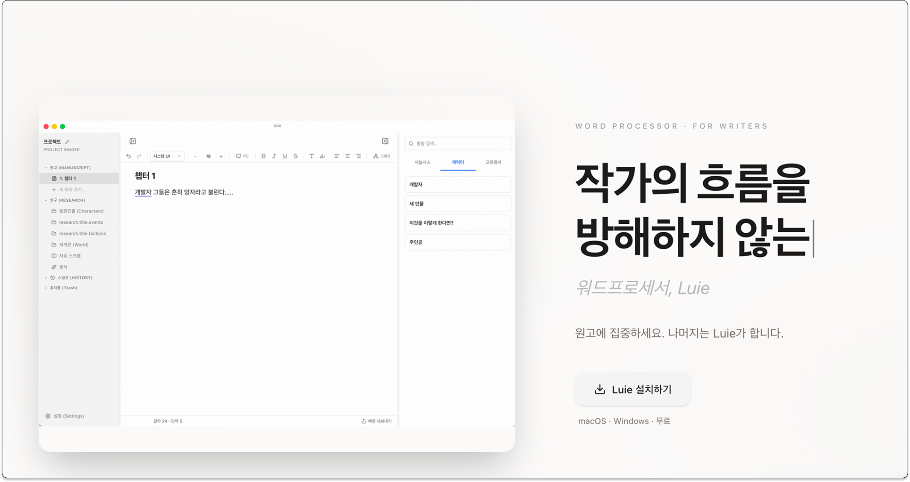
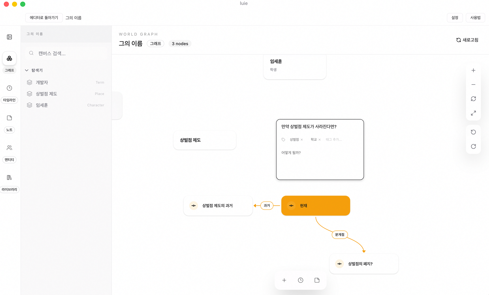
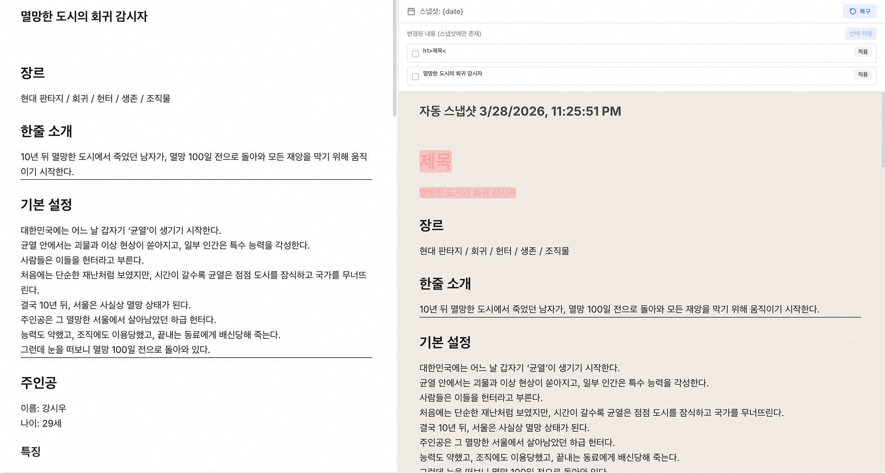
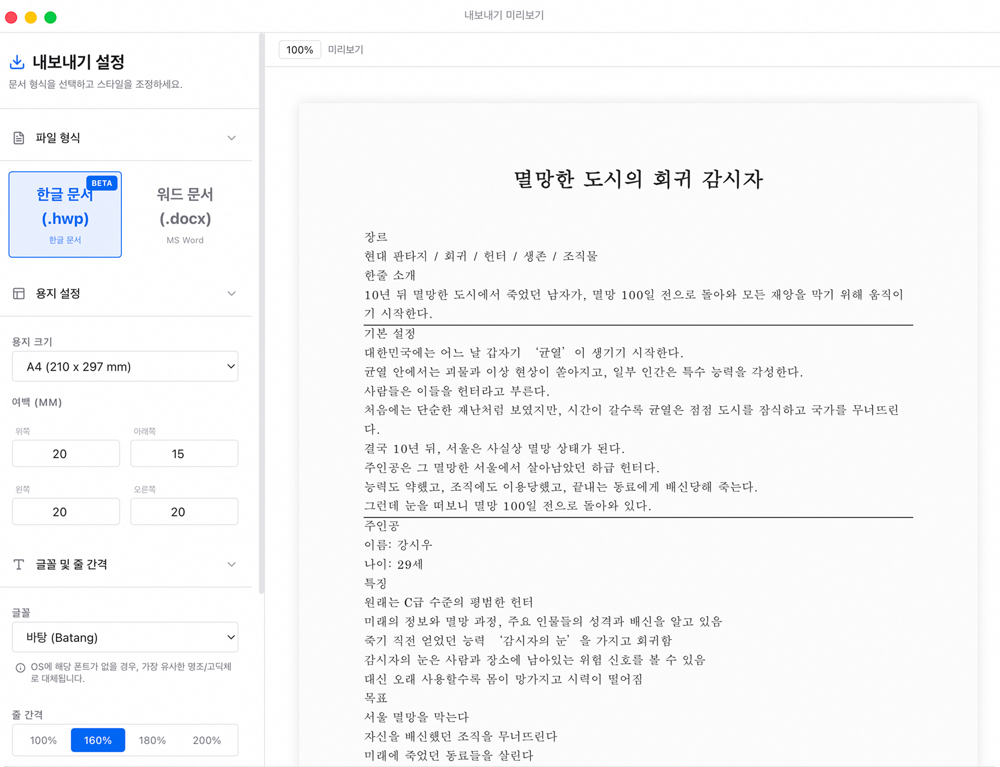
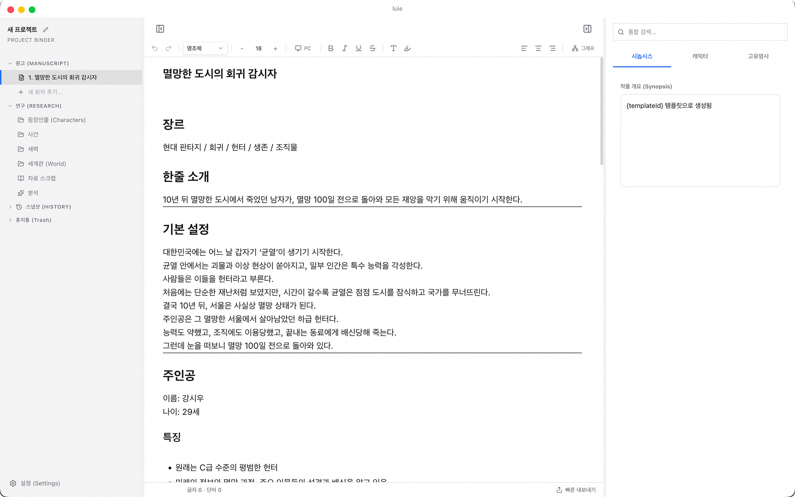
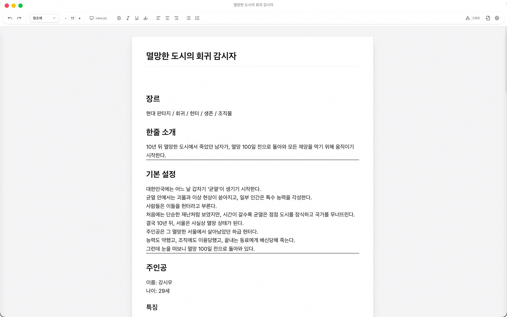
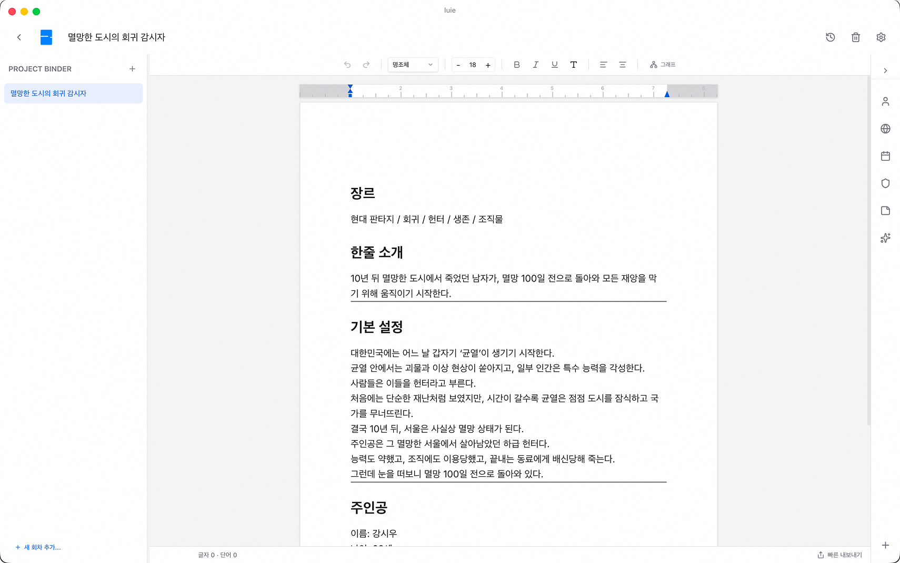
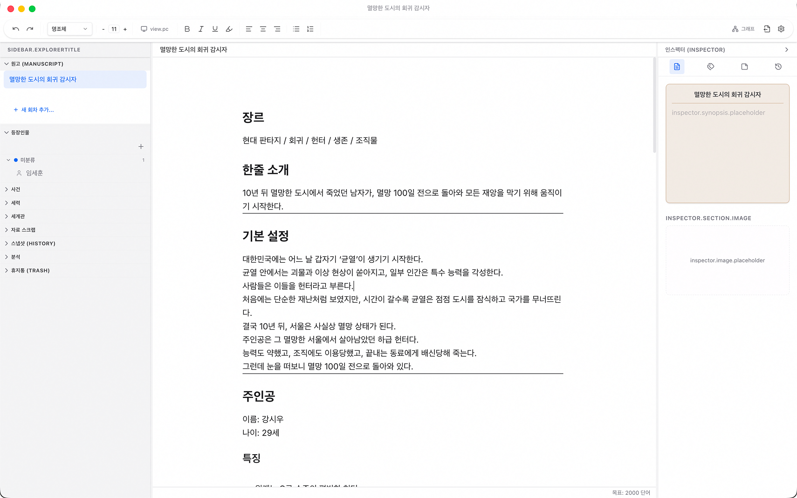
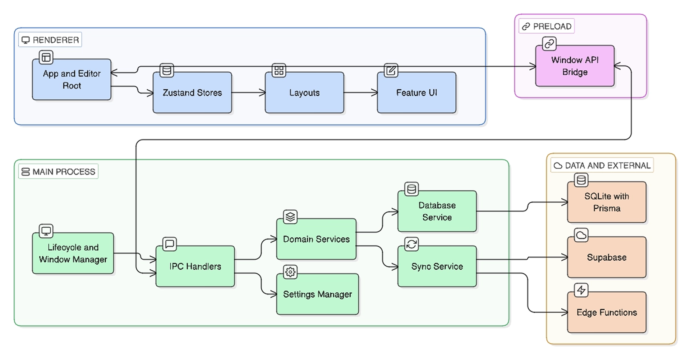
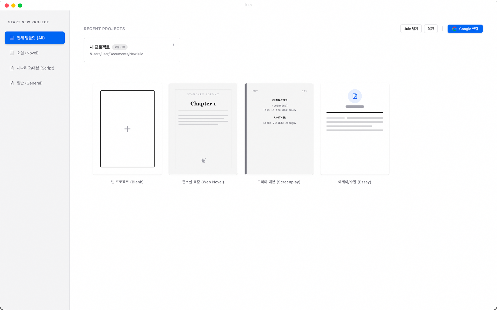

# Luie

장편 집필에서 흩어진 원고, 세계관, 스냅샷, 내보내기를 하나의 흐름으로 묶은 Electron 기반 데스크톱 워크스페이스

- 배포 URL: https://eluie.kro.kr/

<!-- Hero GIF -->

<!-- 추천: 템플릿 선택 → 에디터 진입 → World Graph → Export Preview -->


**Tech Stack**
Electron · React · TypeScript · Zustand · SQLite · Prisma · Tiptap ·  TailwindCSS

---

# 프로젝트 소개

장편 집필은 단순히 글만 쓰는 작업이 아닙니다.

원고를 쓰는 동시에 캐릭터, 용어, 사건, 관계, 플롯, 스냅샷, 출력물까지 함께 관리해야 합니다.
하지만 기존 작업 방식은 문서와 설정 자료가 흩어지고, 저장과 복구 흐름이 분리되며, 출력 직전에 다시 포맷을 수정해야 하는 문제가 있었습니다.

특히 기존 서비스들은 다음과 같은 한계가 있었습니다.

* Google Docs는 긴 장편 프로젝트를 관리하기에는 구조화가 부족했습니다.
* Scrivener는 강력하지만 학습 비용이 높았습니다.
* Obsidian은 자유도가 높지만 사용자가 직접 환경을 설계해야 했습니다.
* 기존 프로젝트였던 Loop는 AI 중심 구조로 인해 실제 작가들의 집필 흐름과 맞지 않았습니다.

Luie는 이러한 문제를 줄이기 위해, 집필·정리·복구·출력을 하나의 프로젝트 단위로 연결하는 데스크톱 워크스페이스로 설계했습니다.

---

# 주요 기능

## 1. Writing + World 통합

원고 작성과 설정 관리를 같은 프로젝트 안에서 이어지게 구성했습니다.

* 챕터를 작성하다가 바로 캐릭터를 추가
* 용어와 사건을 연결
* World Graph에서 관계를 시각적으로 확인
* 다시 원고로 돌아와 이어서 작성



---

## 2. Snapshot / Recovery

저장 실패가 바로 작업 손실로 이어지지 않도록 자동 저장, 스냅샷, 복구 후보, 비상 저장 흐름을 분리했습니다.

* 자동 저장 미러 파일 유지
* 스냅샷 생성 및 복원
* 앱 종료 시 Critical Flush 수행
* 손상된 프로젝트 복구 후보 자동 탐색



---

## 3. Export Preview

DOCX / HWPX 출력 전에 미리보기와 설정 패널을 통해 최종 결과를 먼저 검수할 수 있도록 구성했습니다.

* 페이지 번호 확인
* 여백 / 줄간격 / 글꼴 조정
* 출력 전 미리보기 지원
* DOCX / HWPX 선택 가능



---

## 4. Layout Modes

사용자마다 익숙한 작업 방식이 다르기 때문에, 여러 레이아웃 모드를 지원했습니다.

* Default Mode
* Google Docs Style
* Scrivener Style
* Minimal Editor Mode

사용자는 자신에게 익숙한 환경으로 전환하여 학습 비용을 줄일 수 있습니다.
- Default Mode : 기본 모드

- Editor Mode : 에디터 모드

- Google Docs Style : 구글 독스 스타일

- Scrivener Style : 스크리브너 스타일

---

# Architecture


---

# Technical Decisions

## Why Electron?

Luie는 로컬 파일 저장, 복구 파일 관리, 멀티 윈도우, 네이티브 다이얼로그 등 데스크톱 기능이 중요했습니다.

웹 기술 기반 UI를 빠르게 구축하면서도 OS 기능을 함께 활용할 수 있는 Electron이 가장 적합했습니다.

---

## Why SQLite + Prisma?

장편 프로젝트는 원고뿐 아니라 설정, 스냅샷, 최근 기록 등 다양한 상태를 함께 저장해야 합니다.

SQLite는 단일 파일 기반 저장에 적합했고, Prisma는 타입 안전한 데이터 접근과 스키마 관리를 쉽게 만들 수 있었습니다.

---

## Why `.luie` Package?

프로젝트 파일이 여러 폴더와 JSON 파일로 흩어지면 이동, 백업, 복구가 복잡해집니다.

그래서 Luie는 프로젝트 전체를 `.luie` 단일 파일로 묶었습니다.

```text
project.luie
 ├─ meta.json
 ├─ manuscript/
 ├─ world/
 ├─ snapshots/
 ├─ assets/
 └─ export/
```

이 구조를 통해 프로젝트 이동, 백업, 복구를 단순화할 수 있었습니다.
actecd
---

## Why Zustand Store Separation?

초기에는 하나의 큰 Store에서 모든 UI 상태를 관리했습니다.

하지만 패널 열림 상태, 레이아웃 크기, 에디터 상태가 서로 섞이면서 UI가 깨지거나 불필요한 리렌더링이 발생했습니다.

이를 해결하기 위해 역할 기준으로 Store를 분리했습니다.

* uiStore
* editorStore
* projectStore
* layoutStore

또한 필요한 상태만 선택적으로 구독하도록 구조를 변경해 렌더링 비용을 줄였습니다.

---

# Problem Solving

## 1. 저장 실패 한 번이 긴 작업을 망칠 수 있다

### 문제

장편 원고는 수정량이 많기 때문에, 저장 실패가 곧 데이터 손실로 이어질 수 있었습니다.

### 원인

자동 저장만으로는 렌더러 충돌, 패키지 손상, 파일 복구 실패까지 모두 대응하기 어려웠습니다.

### 해결

* 자동 저장 미러 파일 추가
* 스냅샷 복구 후보 생성
* 비상 저장 파일 유지
* 앱 종료 직전 Critical Flush 수행

### 결과

저장 실패 이후에도 사용자가 다시 이어서 작업할 수 있는 복구 경로를 만들 수 있었습니다.

---

## 2. 원고와 세계관 정보가 분리되면 맥락이 끊긴다

### 문제

캐릭터, 용어, 사건, 관계가 여러 문서에 흩어지면 설정 충돌과 맥락 손실이 발생했습니다.

### 원인

장편 프로젝트는 시간이 지날수록 참조 관계가 많아지고, 사람이 모든 설정을 기억하기 어려워집니다.

### 해결

* Terms, Plot, Synopsis, Mind Map, Drawing, Graph를 하나의 World 영역으로 통합
* World Graph와 선택 상태를 동기화
* 고아 관계 정리 서비스 연결

### 결과

설정이 단순 메모가 아니라, 실제 원고와 연결된 작업 자산으로 동작하게 되었습니다.

---

## 3. 출력은 마지막 버튼이 아니라 검수 단계다

### 문제

출력 직후 포맷이 깨지면 다시 문서를 수정하고 내보내야 했습니다.

### 해결

* DOCX / HWPX 미리보기 제공
* 문단 단위 HTML 정규화
* 페이지 번호, 줄간격, 여백 조정 기능 추가

### 결과

출력 전에 품질을 검수하고, 반복 수정 비용을 줄일 수 있었습니다.

---

# Validation

* 프로젝트 생성 / 챕터 생성 / 자동 저장 / 복원 시나리오 E2E 테스트
* Snapshot / Recovery 흐름 검증
* IPC Contract / Store Persist Contract 검증
* Export 안정성 및 대용량 데이터 처리 검증
* 시각 회귀 테스트 및 앱 초기 부팅 테스트 수행

### Key Results

* 200챕터 생성 스트레스 테스트 검증
* 5,000,000자 규모 World Payload Export 안정성 확인
* 한국어 / 일본어 / 영어 텍스트 기반 저장 및 복구 테스트 완료
* Snapshot / Recovery 시나리오 테스트 통과
* `.luie` 복구 및 대용량 Export 안정성 확인

---

# Screenshots

## Template Select



## Editor


---

# Future Work

* 실제 작가 대상 사용성 테스트
* CI/CD 기반 안정적 배포 환경 구축
* Export 품질 고도화
* Sync 신뢰성 개선
* Plugin 시스템 확장
* World Graph 기능 강화

---

Luie는 단순히 글을 쓰는 앱이 아니라, 장편 집필 과정 전체를 하나의 흐름으로 정리하기 위한 프로젝트입니다.

저는 지금도 이 프로젝트를 계속 개선하면서, 실제 작가들이 사용할 수 있는 수준까지 발전시키는 것을 목표로 하고 있습니다.
