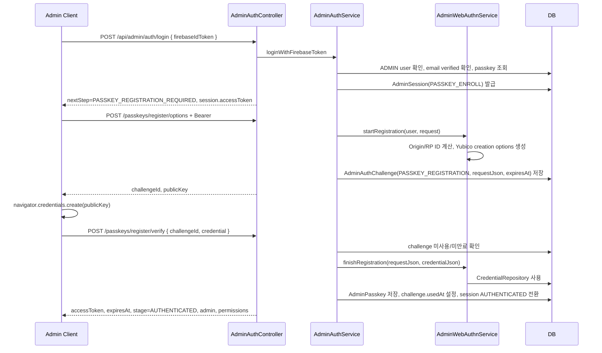
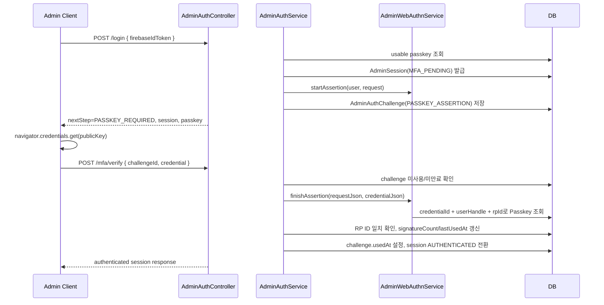

# 어드민 Req/Res 및 WebAuthn 구조

작성 기준: 현재 Spring Boot 백엔드 코드 기준

## 1. 한눈에 보는 전체 구조

```mermaid
flowchart LR
    A["Admin Console / Client"] -->|HTTP Req| B["AdminController / AdminAuthController"]
    B -->|DTO, Query, PathVariable| C["Service Layer"]
    C -->|권한 확인| D["AdminSecurityService"]
    C -->|DB 조회/수정| E["Repository / Entity"]
    C -->|감사 로그| F["AdminAuditService"]
    C -->|ApiResponse.success(data)| B
    B -->|HTTP Res| A

    A -->|Authorization: Bearer token| G["AdminSessionAuthenticationFilter"]
    G -->|token hash 조회| H["admin_sessions"]
    G -->|Principal + Authority 주입| D

    B -->|Passkey options / credential| I["AdminWebAuthnService"]
    I -->|Yubico WebAuthn 검증| J["AdminCredentialRepository"]
    J -->|credential 조회| K["admin_passkeys"]
    I -->|challenge 저장/검증| L["admin_auth_challenges"]
```

핵심은 다음 4가지입니다.

| 구분 | 구현 위치 | 역할 |
|---|---|---|
| 어드민 HTTP 진입점 | `controller/admin/AdminController.java`, `AdminAuthController.java` | `@RequestParam`, `@PathVariable`, `@RequestBody`로 Req를 받고 `ResponseEntity<ApiResponse<T>>`로 Res를 보냄 |
| 공통 응답 래퍼 | `dto/common/ApiResponse.java` | 성공/실패 응답 형태를 통일함 |
| 어드민 인증/인가 | `AdminSessionAuthenticationFilter`, `SecurityConfig`, `AdminSecurityService` | Bearer 세션 토큰을 `AdminPrincipal`로 바꾸고 권한을 검사함 |
| WebAuthn/Passkey | `AdminAuthService`, `AdminWebAuthnService`, `AdminCredentialRepository` | Firebase 로그인 뒤 Passkey 등록/MFA/Step-up을 처리함 |

## 2. 공통 Req/Res 규칙

### 2.1 Req 수신 방식

| 입력 방식 | Spring 코드 형태 | 사용 예 |
|---|---|---|
| Query String | `@RequestParam` | `/api/admin/users?page=1&pageSize=20&status=ACTIVE` |
| URL Path | `@PathVariable` | `/api/admin/users/{userId}` |
| JSON Body | `@RequestBody` | `AdminLoginRequest`, `AdminNotificationSendRequest` |
| 검증 | `@Valid` + `jakarta.validation` | `@NotBlank`, `@NotNull` |
| 원본 HTTP 정보 | `HttpServletRequest` | Origin, Host, RemoteAddr, WebAuthn RP ID 계산 |

요청 바디는 크게 두 종류입니다.

| 종류 | 설명 |
|---|---|
| 명시 DTO | 필드와 검증 조건이 Java 클래스로 고정됨. 예: `AdminLoginRequest`, `AdminPasskeyCredentialRequest` |
| 동적 Map | 수정 가능한 필드가 유연한 API에서 사용됨. 예: 공고 수정, 설정 수정, 기준 데이터 생성/수정 |

### 2.2 Res 송신 방식

일반 JSON 응답은 모두 아래 형태로 감쌉니다.

```json
{
  "ok": true,
  "status": 200,
  "message": "처리 메시지",
  "data": {},
  "error": null,
  "meta": {
    "requestId": "req_xxxxxxxxxxxx",
    "timestamp": "2026-06-30T00:00:00Z"
  }
}
```

실패 응답도 같은 래퍼를 씁니다.

```json
{
  "ok": false,
  "status": 400,
  "message": "오류 메시지",
  "data": null,
  "error": {
    "code": "VALIDATION_ERROR",
    "message": "요청 값 검증에 실패했습니다.",
    "detail": {
      "field": "reason"
    }
  },
  "meta": {
    "requestId": "req_xxxxxxxxxxxx",
    "timestamp": "2026-06-30T00:00:00Z"
  }
}
```

CSV 다운로드만 예외입니다. CSV API는 `ApiResponse`로 감싸지 않고 `ResponseEntity<byte[]>`로 바로 내려보냅니다.

| CSV 처리 | 내용 |
|---|---|
| 인코딩 | UTF-8 BOM 포함 |
| Content-Type | `text/csv; charset=UTF-8` |
| Header | `Content-Disposition: attachment; filename="..."` |
| 대상 | 사용자, 공고, 신고, 알림 이력, 감사 로그 export |

### 2.3 에러 처리

| 상황 | 코드 |
|---|---|
| 서비스에서 명시적으로 던짐 | `ApiException` |
| DTO 검증 실패 | `VALIDATION_ERROR` |
| JSON 파싱 실패 | `INVALID_JSON` |
| 필수 파라미터 누락 | `MISSING_PARAMETER` |
| 인증 없음 | `UNAUTHORIZED` |
| 권한 없음 | `ACCESS_DENIED` 또는 `ADMIN_PERMISSION_DENIED` |
| 알 수 없는 서버 오류 | `INTERNAL_SERVER_ERROR` |

## 3. 어드민 인증/인가 흐름

### 3.1 보안 필터 흐름

`AdminSessionAuthenticationFilter`는 `/api/admin/` 요청만 검사합니다.

1. `Authorization: Bearer <accessToken>` 헤더를 읽습니다.
2. 원문 토큰을 SHA-256 해시해서 `admin_sessions.token_hash`와 비교합니다.
3. 세션이 만료/폐기되지 않았으면 `AdminSession`을 복원합니다.
4. 사용자 정보를 다시 조회합니다.
5. `AUTHENTICATED` 세션인데 사용자의 Passkey가 모두 삭제되어 있으면 세션을 revoke합니다.
6. `AdminPrincipal`을 만들고 Spring SecurityContext에 넣습니다.
7. 세션 `lastUsedAt`을 갱신합니다. 단, 30초 이내 반복 요청은 갱신을 생략합니다.

### 3.2 세션 단계

| Stage | 의미 | 가능 작업 |
|---|---|---|
| `PASSKEY_ENROLL` | Firebase 로그인은 끝났지만 Passkey 최초 등록 필요 | Passkey 등록 options/verify |
| `MFA_PENDING` | 기존 Passkey가 있어 MFA 인증 대기 | MFA options/verify, Passkey reset |
| `AUTHENTICATED` | Passkey까지 완료된 어드민 세션 | 일반 `/api/admin/**` 업무 API |

### 3.3 SecurityConfig 접근 규칙

| 요청 | 접근 규칙 |
|---|---|
| `POST /api/admin/auth/login` | permitAll |
| `GET /api/admin/auth/session` | permitAll |
| `POST /api/admin/users/promote/email` | `ROLE_ADMIN_CONSOLE` 통과 후 서비스에서 Step-up + `ADMIN_PROMOTE` 재검사 |
| `/api/admin/auth/**` | `ROLE_ADMIN_CONSOLE` |
| `/api/admin/**` | `ROLE_ADMIN` |

`ROLE_ADMIN_CONSOLE`은 어드민 세션이 있으면 붙습니다. `ROLE_ADMIN`은 세션 stage가 `AUTHENTICATED`일 때만 붙습니다.

### 3.4 세부 권한

서비스 계층은 `AdminSecurityService.require(...)`로 기능별 권한을 다시 검사합니다.

| 권한 | 대표 기능 |
|---|---|
| `AUDIT_READ` | 대시보드, 사용자/공고/커뮤니티 조회, 감사 로그, 기준 데이터 요약 |
| `NOTICE_WRITE` | 공고/커뮤니티 숨김, 복구, 수정, 삭제 |
| `USER_SUSPEND` | 사용자 정지/해제/탈퇴 처리 |
| `REPORT_REVIEW` | 신고 목록/상세/처리 |
| `ADMIN_PROMOTE` | 어드민 승격 |
| `NOTIFICATION_SEND` | 관리자 알림 발송/이력 |
| `INTEGRATION_MANAGE` | DB/Redis/Firebase/Shelter API 상태 점검 |
| `SETTINGS_MANAGE` | 콘솔 설정, 기준 데이터 관리 |

## 4. 어드민 Auth API

Base path: `/api/admin/auth`

| Method | Path | Req | Res `data` | 설명 |
|---|---|---|---|---|
| POST | `/login` | body `AdminLoginRequest` | `AdminLoginResponse` | Firebase ID Token으로 어드민 로그인 시작 |
| POST | `/passkeys/register/options` | Bearer token | `AdminPasskeyOptionsResponse` | 최초 Passkey 등록용 WebAuthn creation options 발급 |
| POST | `/passkeys/register/verify` | body `AdminPasskeyCredentialRequest` | `AdminAuthSessionResponse` | 등록 credential 검증 후 세션을 `AUTHENTICATED`로 전환 |
| POST | `/mfa/options` | Bearer token | `AdminPasskeyOptionsResponse` | MFA assertion options 재발급 또는 기존 challenge 재사용 |
| POST | `/mfa/verify` | body `AdminPasskeyCredentialRequest` | `AdminAuthSessionResponse` | Passkey MFA 검증 |
| POST | `/stepup/options` | Bearer token | `AdminPasskeyOptionsResponse` | 관리자 승격 같은 민감 작업 전 재인증 options 발급 |
| POST | `/stepup/verify` | body `AdminPasskeyCredentialRequest` | `AdminAuthSessionResponse` | Step-up 검증 후 `elevatedUntil` 설정 |
| POST | `/passkeys/reset` | Bearer token, `MFA_PENDING` | `AdminAuthSessionResponse` | 기존 Passkey 삭제 후 `PASSKEY_ENROLL`로 되돌림 |
| GET | `/session` | 선택적 Bearer token | `AdminSessionStateResponse` | 현재 어드민 세션 상태 조회. 세션 없으면 `authenticated=false` |
| POST | `/logout` | Bearer token | `null` | 현재 세션 revoke |
| POST | `/refresh` | Bearer token, `AUTHENTICATED` | `AdminAuthSessionResponse` | 새 토큰을 발급하고 기존 세션 revoke |

### Auth DTO

| DTO | 필드 |
|---|---|
| `AdminLoginRequest` | `firebaseIdToken` |
| `AdminLoginResponse` | `nextStep`, `requiresPassKey`, `session`, `passkey` |
| `AdminPasskeyOptionsResponse` | `challengeId`, `publicKey` |
| `AdminPasskeyCredentialRequest` | `challengeId` 필수, `credential` 필수 |
| `AdminAuthSessionResponse` | `accessToken`, `expiresAt`, `stage`, `admin`, `permissions` |
| `AdminAuthSessionAdminResponse` | `id`, `email`, `name`, `role` |
| `AdminSessionStateResponse` | `authenticated`, `stage`, `admin`, `permissions`, `expiresAt` |

### 로그인 `nextStep`

| nextStep | 의미 | 다음 호출 |
|---|---|---|
| `EMAIL_VERIFICATION_REQUIRED` | Firebase 이메일 인증 필요 | 이메일 인증 완료 후 `/login` 재시도 |
| `PASSKEY_REGISTRATION_REQUIRED` | 등록된 Passkey 없음 | `/passkeys/register/options` -> `/passkeys/register/verify` |
| `PASSKEY_REQUIRED` | 등록된 Passkey 있음 | 응답의 `passkey` 또는 `/mfa/options` -> `/mfa/verify` |

## 5. 어드민 업무 API 전체 목록

Base path: `/api/admin`

### 5.1 대시보드

| Method | Path | Req | Res `data` | 권한 |
|---|---|---|---|---|
| GET | `/dashboard` | 없음 | `AdminDashboardResponse` | `AUDIT_READ` |
| GET | `/dashboard/summary` | query `from`, `to` | KPI, 최근 신고, 최근 알림 실패 | `AUDIT_READ` |
| GET | `/dashboard/timeline` | query `from`, `to`, `granularity=day` | `{ granularity, series[] }` | `AUDIT_READ` |
| GET | `/dashboard/priorities` | 없음 | 우선 처리 신고 목록 | `REPORT_REVIEW` |

`AdminDashboardResponse`: `todayReports`, `pendingReports`, `hiddenCommunityPosts`, `hiddenMissingPosts`, `sanctionedUsers`

### 5.2 사용자/어드민 권한

| Method | Path | Req | Res `data` | 권한 |
|---|---|---|---|---|
| GET | `/users` | query `query`, `status`, `role`, `createdFrom`, `createdTo`, `page`, `pageSize`, `sortBy`, `sortOrder` | `{ items, page, pageSize, total }` | `AUDIT_READ` |
| GET | `/users/export.csv` | `/users`와 동일 | CSV | `AUDIT_READ` |
| GET | `/users/{userId}` | path `userId` | 사용자 상세, 공고, 커뮤니티 글, 신고 | `AUDIT_READ` |
| PATCH | `/users/{userId}/role` | body `AdminUserRoleUpdateRequest` | `{ id, role }` | `ADMIN_PROMOTE` |
| PATCH | `/users/{userId}/status` | body `AdminUserStatusUpdateRequest` | `{ id, status }` | `USER_SUSPEND` |
| POST | `/users/{userId}/suspend` | path `userId` | `{ id, status }` | `USER_SUSPEND` |
| POST | `/users/{userId}/unsuspend` | path `userId` | `{ id, status }` | `USER_SUSPEND` |
| PATCH | `/users/{userId}/sanctions` | body `AdminUserSanctionRequest` | `AdminUserSanctionResponse` | `USER_SUSPEND` |
| PATCH | `/users/promote` | body `AdminPromoteRequest` | `AdminPromoteResponse` | Step-up + `ADMIN_PROMOTE` |
| POST | `/users/promote/email` | body `AdminPromoteByEmailRequest` | `AdminPromoteResponse` | Step-up + `ADMIN_PROMOTE` |
| GET | `/users/permissions/status` | 없음 | `AdminStatusResponse` | `AUDIT_READ` |

사용자 목록 item 주요 필드: `id`, `name`, `email`, `role`, `status`, `createdAt`, `lastLoginAt`, `presence`, `presenceConnectionState`, `presenceLastActiveAt`

요청 DTO:

| DTO | 필드/값 |
|---|---|
| `AdminUserRoleUpdateRequest` | `role`: `USER`, `ADMIN` |
| `AdminUserStatusUpdateRequest` | `status`: `ACTIVE/NORMAL`, `SUSPENDED/BANNED/STOPPED`, `WITHDRAWN/DELETED` |
| `AdminUserSanctionRequest` | `action`: `BAN/BANNED/TEMP_SUSPEND/SUSPEND`, `UNBAN/RELEASE/ACTIVATE/ACTIVE`, `WITHDRAW/WITHDRAWN` |
| `AdminPromoteRequest` | `userId` 필수 |
| `AdminPromoteByEmailRequest` | `email` 필수 |

응답 DTO:

| DTO | 필드 |
|---|---|
| `AdminPromoteResponse` | `userId`, `email`, `role`, `status` |
| `AdminUserSanctionResponse` | `userId`, `action`, `status` |
| `AdminStatusResponse` | `summary`, `admins[]` |
| `AdminStatusSummaryResponse` | 전체/활성/정지/탈퇴 어드민 수 |
| `AdminStatusItemResponse` | 어드민 id, email, nickname, role, status, permissions, 이메일 인증 상태 |

### 5.3 실종 공고

| Method | Path | Req | Res `data` | 권한 |
|---|---|---|---|---|
| GET | `/notices` | query `query`, `region`, `breed`, `status`, `from`, `to`, `page`, `pageSize`, `sortBy`, `sortOrder` | `{ items, page, pageSize, total }` | `AUDIT_READ` |
| GET | `/notices/export.csv` | `/notices`와 동일 | CSV | `AUDIT_READ` |
| GET | `/notices/{noticeId}` | path `noticeId` | 공고 상세 | `AUDIT_READ` |
| PATCH | `/notices/{noticeId}` | body `Map` | 수정된 공고 상세 | `NOTICE_WRITE` |
| POST | `/notices/{noticeId}/hide` | path `noticeId` | `AdminVisibilityResponse` 형태의 Map | `NOTICE_WRITE` |
| POST | `/notices/{noticeId}/restore` | path `noticeId` | `AdminVisibilityResponse` 형태의 Map | `NOTICE_WRITE` |
| DELETE | `/notices/{noticeId}` | path `noticeId` | `AdminDeleteResponse` 형태의 Map | `NOTICE_WRITE` |
| PATCH | `/posts/{postId}/visibility` | body `AdminVisibilityUpdateRequest` | `AdminVisibilityResponse` | `NOTICE_WRITE` |
| DELETE | `/posts/{postId}` | path `postId` | `AdminDeleteResponse` | `NOTICE_WRITE` |

공고 목록 item 주요 필드: `id`, `title`, `animalType`, `status`, `reporter`, `reportedAt`, `thumbnailUrl`, `hidden`, `region`

공고 상세 추가 필드: `content`, `breed`, `gender`, `age`, `color`, `location`, `missingDate`, `rewardAmount`, `contactPhone`, `images`, `reportCount`

`PATCH /notices/{noticeId}`에서 받을 수 있는 Map 키:

| 키 | 처리 |
|---|---|
| `title` | 제목 수정 |
| `description` | 내용 수정 |
| `animalType` | 동물 타입 정규화 후 수정 |
| `breed` | 품종 수정 |
| `missingRegion` | 실종 지역 수정 |
| `missingAddress` | 실종 주소 수정 |
| `contactPhone` | 연락처 수정 |
| `rewardAmount` | 사례금 수정 |
| `status` | `HIDDEN`, `LOST`, `FOUND`, `RESOLVED`, `REPORTED` |

### 5.4 커뮤니티

| Method | Path | Req | Res `data` | 권한 |
|---|---|---|---|---|
| PATCH | `/community/posts/{postId}/visibility` | body `AdminVisibilityUpdateRequest` | `AdminVisibilityResponse` | `NOTICE_WRITE` |
| GET | `/community/posts` | query `query`, `category`, `status`, `page`, `pageSize`, `sortBy`, `sortOrder` | `{ items, page, pageSize, total }` | `AUDIT_READ` |
| GET | `/community/posts/{postId}` | path `postId` | 커뮤니티 글 상세 | `AUDIT_READ` |
| DELETE | `/community/posts/{postId}` | path `postId` | `AdminDeleteResponse` 형태의 Map | `NOTICE_WRITE` |

커뮤니티 목록 item 주요 필드: `id`, `title`, `author`, `likes`, `comments`, `createdAt`, `status`, `category`

커뮤니티 상세 추가 필드: `content`, `tags`, `images`, `poll`, `votes`, `reactions`, `comments`

`AdminVisibilityUpdateRequest.visibility` 허용 값:

| 공개 | 숨김 |
|---|---|
| `VISIBLE`, `PUBLIC`, `SHOW` | `HIDDEN`, `HIDE`, `PRIVATE` |

### 5.5 신고

| Method | Path | Req | Res `data` | 권한 |
|---|---|---|---|---|
| GET | `/reports` | query `status`, `targetType`, `page`, `pageSize` | `{ items, page, pageSize, total }` | `REPORT_REVIEW` |
| GET | `/reports/export.csv` | `/reports`와 동일 | CSV | `REPORT_REVIEW` |
| GET | `/reports/{reportId}` | path `reportId` | 신고 상세 | `REPORT_REVIEW` |
| GET | `/reports/{reportId}/reporters` | path `reportId` | 같은 대상 신고자 목록 | `REPORT_REVIEW` |
| PATCH | `/reports/{reportId}` | body `ReportStatusUpdateRequest` | `ReportResponse` | `REPORT_REVIEW` |
| PATCH | `/reports/{reportId}/review` | body `AdminReportReviewRequest` | 처리 후 신고 상세 Map | `REPORT_REVIEW` |
| POST | `/reports/{reportId}/dismiss` | optional body `AdminReportActionRequest` | 처리 후 신고 상세 Map | `REPORT_REVIEW` |
| POST | `/reports/{reportId}/warn` | optional body `AdminReportActionRequest` | 대상 사용자 제재 후 신고 상세 Map | `REPORT_REVIEW` |
| POST | `/reports/{reportId}/delete-target` | optional body `AdminReportActionRequest` | 대상 삭제 후 신고 상세 Map | `REPORT_REVIEW` |
| POST | `/reports/{reportId}/resolve` | optional body `AdminReportActionRequest` | 신고 해결 처리 상세 Map | `REPORT_REVIEW` |

신고 목록 item 주요 필드: `id`, `targetType`, `reason`, `reporterCount`, `status`, `lastReportedAt`, `targetId`

신고 상세 주요 필드: `id`, `targetType`, `targetId`, `reason`, `description`, `status`, `reporterCount`, `reporters`, `targetTitle`, `targetUrl`, `target`, `reviewedById`, `reviewedByNickname`, `processReason`, `processedAction`, `reviewedAt`, `createdAt`

신고 관련 값:

| 항목 | 허용 값 |
|---|---|
| `status` query | `PENDING/RECEIVED`, `REVIEWING`, `RESOLVED`, `REJECTED/DISMISSED` |
| `targetType` query | `NOTICE/PET_NOTICE`, `COMMUNITY_POST`, `COMMUNITY_COMMENT`, `NOTICE_CHAT_ROOM`, `USER` |
| `processAction` | `NONE`, `HIDE_TARGET`, `DELETE_TARGET`, `SANCTION_TARGET_USER` |
| `AdminReportActionRequest` | `memo` |

### 5.6 알림

| Method | Path | Req | Res `data` | 권한 |
|---|---|---|---|---|
| POST | `/notifications/send` | body `AdminNotificationSendRequest` | 발송 결과 Map | `NOTIFICATION_SEND` |
| GET | `/notifications/history` | query `page`, `pageSize` | `{ items, page, pageSize, total }` | `NOTIFICATION_SEND` |
| GET | `/notifications/history/export.csv` | query `page`, `pageSize` | CSV | `NOTIFICATION_SEND` |

`AdminNotificationSendRequest`:

| 필드 | 설명 |
|---|---|
| `target` | `all`, `active`, `specific` |
| `title` | 알림 제목 |
| `body` | 알림 본문 |
| `userIds` | `target=specific`일 때 대상 사용자 ID 목록 |

발송 결과 주요 필드: `id`, `title`, `body`, `target`, `sentAt`, `status`, `targetCount`, `deliveredCount`, `failedCount`, `deliveredUserCount`, `skippedCount`, `failedTokenCount`

### 5.7 연동/서비스 상태

| Method | Path | Req | Res `data` | 권한 |
|---|---|---|---|---|
| GET | `/integrations/overview` | query `forceRefresh=false` | 연동 상태 목록 | `INTEGRATION_MANAGE` |
| GET | `/services/overview` | query `forceRefresh=false` | `{ globalStatus, services }` | `INTEGRATION_MANAGE` |
| GET | `/integrations/{integrationKey}` | path `integrationKey` | 연동 상세 | `INTEGRATION_MANAGE` |
| GET | `/services/{serviceId}` | path `serviceId` | 서비스 상세 | `INTEGRATION_MANAGE` |
| POST | `/integrations/{integrationKey}/recheck` | path `integrationKey` | 재점검 결과 | `INTEGRATION_MANAGE` |
| POST | `/services/{serviceId}/reboot` | path `serviceId` | 재점검 결과 | `INTEGRATION_MANAGE` |
| GET | `/services/{serviceId}/logs` | path `serviceId`, query `limit=100` | 최근 로그 목록 | `INTEGRATION_MANAGE` |

점검 대상: `DATABASE`, `REDIS`, `FIREBASE`, `SHELTER_API`, `GLOBAL`, `ALL`

연동 상세 주요 필드: `id`, `name`, `status`, `uptime`, `latency`, `cluster`, `telemetry`, `recentLogs`, `latest`, `logs`

### 5.8 감사 로그

| Method | Path | Req | Res `data` | 권한 |
|---|---|---|---|---|
| GET | `/audit-logs` | query `query`, `page`, `pageSize` | `{ items, page, pageSize, total }` | `AUDIT_READ` |
| GET | `/audit-logs/export.csv` | query `query`, `page`, `pageSize` | CSV | `AUDIT_READ` |
| GET | `/audit-logs/{logId}` | path `logId` | 감사 로그 상세 | `AUDIT_READ` |

감사 로그 목록 item 주요 필드: `id`, `action`, `targetType`, `targetId`, `ipAddress`, `timestamp`, `adminName`

상세 추가 필드: `before`, `after`, `metadata`

### 5.9 설정/기준 데이터

| Method | Path | Req | Res `data` | 권한 |
|---|---|---|---|---|
| GET | `/settings` | 없음 | 콘솔 설정 Map | `SETTINGS_MANAGE` |
| PATCH | `/settings` | body `Map` | 수정 후 설정 Map | `SETTINGS_MANAGE` |
| GET | `/reference-data` | 없음 | 기준 데이터 개수 요약 | `AUDIT_READ` |
| GET | `/reference-data/{kind}` | path `kind` | 기준 데이터 목록 | `SETTINGS_MANAGE` |
| POST | `/reference-data/{kind}` | body `Map` | 생성 결과 | `SETTINGS_MANAGE` |
| PATCH | `/reference-data/{kind}/{id}` | body `Map` | 수정 결과 | `SETTINGS_MANAGE` |
| DELETE | `/reference-data/{kind}/{id}` | path `kind`, `id` | `null` | `SETTINGS_MANAGE` |

설정 응답 주요 필드:

`siteName`, `supportEmail`, `defaultLanguage`, `logoUrl`, `apiEndpoint`, `autoSyncEnabled`, `globalPushEnabled`, `fcmServerKeyMasked`, `firebaseProjectId`, `fcmConfigured`, `shelterApiConfigured`

`PATCH /settings` 허용 키:

`siteName`, `supportEmail`, `defaultLanguage`, `logoUrl`, `apiEndpoint`, `autoSyncEnabled`, `globalPushEnabled`, `fcmServerKey`

기준 데이터 `kind`:

| 외부 입력 | 내부 값 |
|---|---|
| `animal-types`, `animal_types`, `animaltypes` | `ANIMAL_TYPES` |
| `region-codes`, `region_codes`, `regioncodes` | `REGION_CODES` |
| `notice-status-labels`, `notice_status_labels`, `noticestatuslabels` | `NOTICE_STATUS_LABELS` |

기준 데이터 body:

| API | 필드 |
|---|---|
| create | `key` 필수, `label` 필수, `active` 선택, `metadata` 선택 |
| update | `key`, `label`, `active`, `metadata` 중 필요한 필드 |

### 5.10 Req/Res 트래픽 로그

| Method | Path | Req | Res `data` | 권한 |
|---|---|---|---|---|
| GET | `/traffic/logs` | query `limit=100`, `errorsOnly=false` | `{ items, errorCount }` | `ROLE_ADMIN` |
| GET | `/traffic/config` | 없음 | `{ trackedApiPrefixes, errorStatusFilter }` | `ROLE_ADMIN` |

트래픽 로그 item 주요 필드:

| direction | 필드 |
|---|---|
| `IN` | `timestamp`, `method`, `path`, `status`, `durationMs`, `remoteAddr`, `requestBody`, `responseBody` |
| `OUT` | `timestamp`, `method`, `path`, `status`, `durationMs`, `remoteAddr` |

## 6. Req/Res 트래픽을 어떻게 수집하는가

### 6.1 Inbound Req/Res

`AdminTrafficLogbookConfig`가 `LogbookFilter`를 `/*`에 등록합니다.

1. 요청 시작 시 correlation id별 시작 시간을 저장합니다.
2. 응답 완료 시 request/response를 읽습니다.
3. 정적 리소스, HTML, JS, CSS, 이미지, `/api/admin/traffic/**`는 제외합니다.
4. text/json/form body만 저장하고 그 외는 `<non-text>`로 기록합니다.
5. body는 민감 필드를 마스킹하고 2000자까지만 저장합니다.
6. `AdminTrafficLogService.recordInbound(...)`로 인메모리 큐에 저장합니다.

마스킹 대상 예:

`authorization`, `cookie`, `accessToken`, `refreshToken`, `idToken`, `firebaseIdToken`, `password`, `purchaseToken`, `serviceKey`, `api_key`, `x-ai-api-key`, `secret`

### 6.2 Outbound Req

외부로 나가는 호출은 두 경로에서 수집됩니다.

| 경로 | 구현 | 기록 방식 |
|---|---|---|
| `WebClient` | `WebClientConfig` | 성공 status 또는 실패 status `0` 기록 |
| Shelter 공공 API `HttpClient` | `ShelterPublicApiClient` | 응답 status와 duration 기록, 예외 시 status `0` |

Outbound 로그는 응답 body까지 저장하지 않고 `method`, `url/path`, `status`, `durationMs`, `source` 중심으로 기록합니다.

### 6.3 저장 방식

`AdminTrafficLogService`는 DB가 아니라 인메모리 `Deque`에 최근 500개만 보관합니다.

| 기능 | 동작 |
|---|---|
| 최대 저장 | 500개 |
| 조회 limit | 1 이상 200 이하로 보정 |
| errorsOnly | status `0` 또는 `400 이상`만 필터 |
| 민감 query | token/key/password/serviceKey/purchaseToken 등은 `[REDACTED]` |
| 제외 경로 | `/api/admin/traffic/**` 자체는 로그에서 제외 |

## 7. WebAuthn/Passkey 구현 구조

### 7.1 사용 라이브러리

`build.gradle`에서 `com.yubico:webauthn-server-core:2.8.1`을 사용합니다.

주요 클래스:

| 클래스 | 역할 |
|---|---|
| `RelyingParty` | WebAuthn 등록/인증 검증의 중심 |
| `PublicKeyCredentialCreationOptions` | 등록 options |
| `AssertionRequest` | 인증 assertion options |
| `PublicKeyCredential` | 브라우저가 보낸 credential 파싱 |
| `CredentialRepository` | Yubico가 credential을 찾기 위해 호출하는 저장소 인터페이스 |

### 7.2 설정값

`application.yml`의 `app.admin.console` 하위 설정을 사용합니다.

| 설정 | 기본/예시 | 의미 |
|---|---|---|
| `session-ttl-seconds` | `.env.local`: `28800` | 인증 완료 세션 TTL. 8시간 |
| `bootstrap-session-ttl-seconds` | `.env.local`: `900` | Passkey 등록/MFA 대기 세션 TTL. 15분 |
| `challenge-ttl-seconds` | `.env.local`: `300` | WebAuthn challenge TTL. 5분 |
| `promote-stepup-ttl-seconds` | `300` | 어드민 승격용 Step-up 유효 시간. 5분 |
| `webauthn.rp-id` | `pawgen.kro.kr` | RP ID |
| `webauthn.rp-name` | `Pogun Admin` | 인증기 화면에 표시될 RP 이름 |
| `webauthn.allowed-origins` | `https://pawgen.kro.kr` | 허용 Origin |
| `webauthn.origin-rp-map` | `https://pawgen.kro.kr=pawgen.kro.kr` | Origin별 RP ID 매핑 |

### 7.3 저장 테이블

| Entity/Table | 주요 필드 | 역할 |
|---|---|---|
| `AdminSession` / `admin_sessions` | `user`, `tokenHash`, `stage`, `expiresAt`, `lastUsedAt`, `revokedAt`, `elevatedUntil` | 어드민 세션 저장. 원문 토큰은 저장하지 않고 SHA-256 hash만 저장 |
| `AdminAuthChallenge` / `admin_auth_challenges` | `session`, `user`, `type`, `requestJson`, `expiresAt`, `usedAt` | WebAuthn options 원본 JSON과 challenge 상태 저장 |
| `AdminPasskey` / `admin_passkeys` | `user`, `credentialId`, `publicKeyCose`, `signatureCount`, `rpId`, `label`, `transports`, `aaguid`, `lastUsedAt` | 등록된 Passkey credential 저장 |
| `AdminAuditLog` / `admin_audit_logs` | `actorUser`, `action`, `targetType`, `targetId`, `beforeState`, `afterState`, `metadata` | 어드민 행위 감사 로그 |

### 7.4 Origin/RP ID 결정

`AdminWebAuthnService.resolveOriginRpContext(...)`가 요청마다 Origin과 RP ID를 계산합니다.

1. `Origin` 헤더를 정규화합니다.
2. Origin 헤더가 없으면 request의 scheme/serverName/port로 Origin을 만듭니다.
3. `origin-rp-map`에 정확히 매칭되는 Origin이 있으면 해당 RP ID를 사용합니다.
4. 이때 Origin host가 RP ID와 같거나 RP ID의 하위 도메인이어야 합니다.
5. 매핑이 없고 `allowed-origins`에 포함되면 Origin host를 RP ID로 씁니다.
6. 어느 조건도 맞지 않으면 WebAuthn 요청을 거부합니다.

`RelyingParty`는 요청마다 다음 조건으로 생성됩니다.

| 값 | 설정 |
|---|---|
| identity id | 계산된 `rpId` |
| identity name | `rpName` |
| origins | 현재 요청 Origin 1개 |
| allowOriginPort | `true` |
| allowOriginSubdomain | `true` |
| credentialRepository | `AdminCredentialRepository` |

## 8. WebAuthn 상세 플로우

### 8.1 최초 Passkey 등록



등록 시 저장되는 Passkey 값:

| 값 | 출처 |
|---|---|
| `credentialId` | Yubico registration result key id |
| `publicKeyCose` | Yubico registration result public key |
| `signatureCount` | 인증기 signature counter |
| `rpId` | 요청 Origin에서 계산된 RP ID |
| `lastUsedAt` | 등록 완료 시각 |

### 8.2 기존 Passkey MFA 로그인



`/mfa/options`는 아직 유효한 `PASSKEY_ASSERTION` challenge가 있으면 재사용합니다. JSON 복원이 실패하면 해당 challenge를 사용 처리하고 새 challenge를 만들 수 있게 합니다.

### 8.3 Step-up 재인증

민감 작업, 특히 어드민 승격은 일반 로그인만으로 부족합니다.

1. `POST /api/admin/auth/stepup/options`
2. 브라우저에서 `navigator.credentials.get(publicKey)`
3. `POST /api/admin/auth/stepup/verify`
4. 세션에 `elevatedUntil = now + promoteStepupTtlSeconds` 저장
5. `/api/admin/users/promote` 또는 `/api/admin/users/promote/email` 호출
6. 서비스에서 `requirePromoteStepUp()`과 `require(ADMIN_PROMOTE)`를 모두 검사

### 8.4 Passkey reset

`POST /api/admin/auth/passkeys/reset`은 `MFA_PENDING` 단계에서만 가능합니다.

동작:

1. 현재 사용자의 `admin_passkeys`를 모두 삭제합니다.
2. 현재 세션을 `PASSKEY_ENROLL`로 되돌립니다.
3. bootstrap TTL로 만료 시간을 다시 설정합니다.
4. 이후 `/passkeys/register/options`부터 다시 등록합니다.

## 9. AdminCredentialRepository 구조

`AdminCredentialRepository`는 Yubico의 `CredentialRepository` 구현체입니다.

| 메서드 | 동작 |
|---|---|
| `getCredentialIdsForUsername(username)` | email로 User 조회 -> 해당 user의 passkey 목록 -> 현재 RP ID와 맞는 credential descriptor 반환 |
| `getUserHandleForUsername(username)` | email로 User 조회 -> user UUID 문자열 bytes를 userHandle로 반환 |
| `getUsernameForUserHandle(userHandle)` | userHandle bytes를 UUID로 파싱 -> User email 반환 |
| `lookup(credentialId, userHandle)` | credentialId와 user UUID가 모두 맞고 RP ID도 맞는 Passkey 반환 |
| `lookupAll(credentialId)` | credentialId와 RP ID가 맞는 Passkey 반환 |

요청별 RP ID 제한은 `ThreadLocal<String> currentRpId`로 처리합니다.

1. `AdminWebAuthnService`가 검증 시작 전에 `setCurrentRpId(rpId)`를 호출합니다.
2. Yubico가 credential repository를 호출할 때 해당 RP ID로 passkey를 필터링합니다.
3. try-finally에서 `clearCurrentRpId()`를 호출합니다.

이 구조 때문에 같은 credentialId라도 다른 RP ID로 등록된 Passkey는 현재 Origin 요청에서 사용되지 않습니다.

## 10. 감사 로그가 남는 주요 어드민 액션

| 액션 | 발생 시점 |
|---|---|
| `ADMIN_EMAIL_VERIFICATION_SENT` | 어드민 이메일 인증 메일 발송 |
| `ADMIN_LOGIN_PASSKEY_ENROLL_REQUIRED` | 로그인 후 Passkey 등록 필요 |
| `ADMIN_LOGIN_PASSKEY_REQUIRED` | 로그인 후 MFA 필요 |
| `ADMIN_PASSKEY_REGISTERED` | Passkey 최초 등록 완료 |
| `ADMIN_LOGIN_AUTHENTICATED` | MFA 검증 완료 |
| `ADMIN_PROMOTE_STEPUP_VERIFIED` | Step-up 검증 완료 |
| `ADMIN_PASSKEY_RESET` | Passkey reset |
| `ADMIN_LOGOUT` | 로그아웃 |
| `ADMIN_SESSION_REFRESHED` | 세션 refresh |
| `ADMIN_USER_ROLE_UPDATED` | 사용자 role 변경 |
| `ADMIN_USER_STATUS_UPDATED` | 사용자 status 변경 |
| `ADMIN_USER_SANCTIONED` | 사용자 제재 |
| `ADMIN_USER_PROMOTED` | 어드민 승격 |
| `ADMIN_NOTICE_UPDATED` | 공고 수정 |
| `ADMIN_NOTICE_VISIBILITY_UPDATED` | 실종 공고 공개/숨김 |
| `ADMIN_NOTICE_DELETED` | 실종 공고 삭제 |
| `ADMIN_COMMUNITY_VISIBILITY_UPDATED` | 커뮤니티 글 공개/숨김 |
| `ADMIN_COMMUNITY_POST_DELETED` | 커뮤니티 글 삭제 |
| `ADMIN_COMMUNITY_COMMENT_DELETED` | 커뮤니티 댓글 삭제 |
| `ADMIN_REPORT_STATUS_UPDATED` | 신고 상태 변경 |
| `ADMIN_REPORT_REVIEWED` | 신고 review 처리 |
| `ADMIN_REPORT_ACTION_APPLIED` | 신고 quick action 처리 |
| `ADMIN_NOTIFICATION_SENT` | 관리자 알림 발송 |
| `ADMIN_INTEGRATION_RECHECKED` | 연동 상태 재점검 |
| `ADMIN_SETTINGS_UPDATED` | 콘솔 설정 변경 |

감사 로그 저장 시 actor는 현재 `AdminPrincipal`에서 사용자로 복원합니다. 인증 맥락이 없으면 actor 없이도 로그 저장을 시도합니다.

## 11. 코드 위치 요약

| 영역 | 파일 |
|---|---|
| 어드민 업무 컨트롤러 | `src/main/java/com/example/pogun/controller/admin/AdminController.java` |
| 어드민 인증 컨트롤러 | `src/main/java/com/example/pogun/controller/admin/AdminAuthController.java` |
| 공통 응답 | `src/main/java/com/example/pogun/dto/common/ApiResponse.java` |
| 공통 예외 처리 | `src/main/java/com/example/pogun/controller/common/GlobalExceptionHandler.java` |
| Spring Security 설정 | `src/main/java/com/example/pogun/config/security/SecurityConfig.java` |
| 어드민 세션 필터 | `src/main/java/com/example/pogun/config/security/AdminSessionAuthenticationFilter.java` |
| 어드민 인증 서비스 | `src/main/java/com/example/pogun/service/adminauth/AdminAuthService.java` |
| WebAuthn 서비스 | `src/main/java/com/example/pogun/service/adminauth/AdminWebAuthnService.java` |
| Yubico credential 저장소 | `src/main/java/com/example/pogun/service/adminauth/AdminCredentialRepository.java` |
| 세션 토큰 서비스 | `src/main/java/com/example/pogun/service/adminauth/AdminSessionTokenService.java` |
| 권한/보안 서비스 | `src/main/java/com/example/pogun/service/adminauth/AdminSecurityService.java`, `AdminPermissionService.java` |
| 어드민 콘솔 서비스 | `src/main/java/com/example/pogun/service/admin/AdminConsoleService.java` |
| 기존 어드민 기능 서비스 | `src/main/java/com/example/pogun/service/admin/AdminService.java` |
| Req/Res 트래픽 필터 | `src/main/java/com/example/pogun/config/web/AdminTrafficLogbookConfig.java` |
| 트래픽 로그 저장소 | `src/main/java/com/example/pogun/service/admin/AdminTrafficLogService.java` |
| WebClient outbound 로그 | `src/main/java/com/example/pogun/config/web/WebClientConfig.java` |
| WebAuthn 설정 | `src/main/resources/application.yml`, `.env.example`, `.env.local` |
