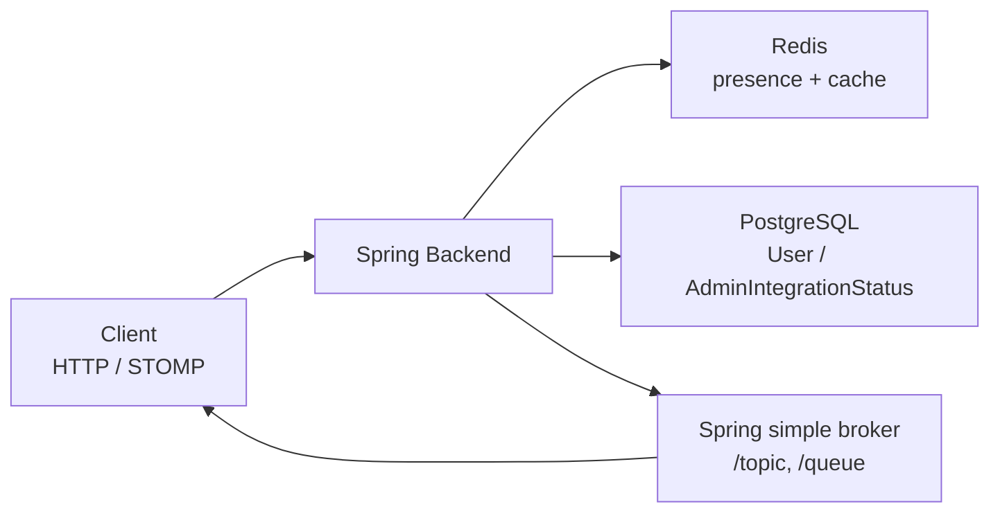
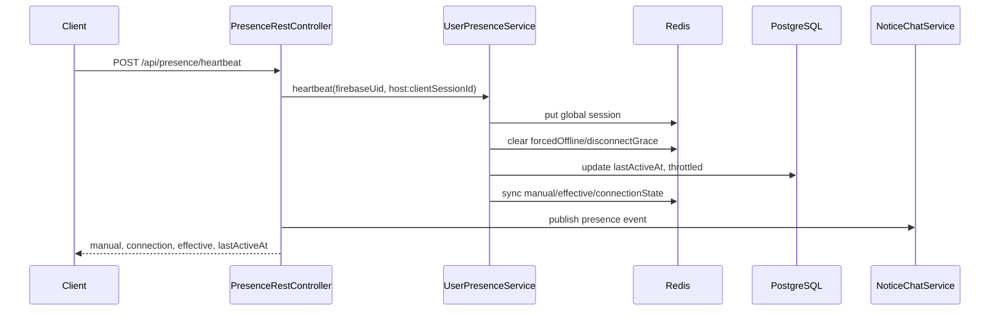
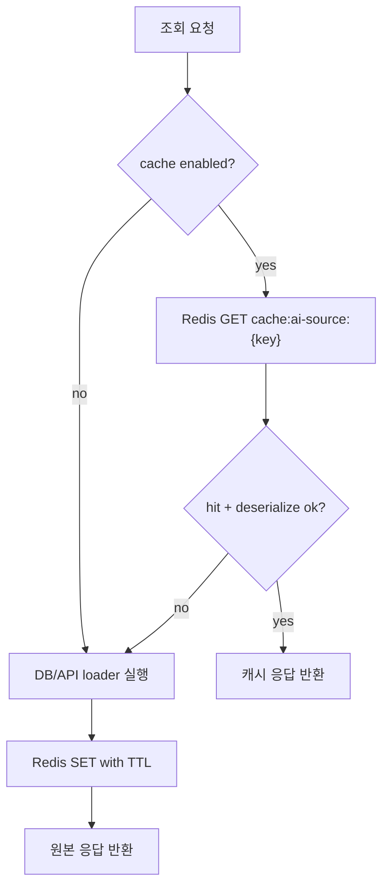

# Redis 사용 및 동작 구조

이 문서는 현재 백엔드에서 Redis가 어떤 기능에 쓰이고, 요청이 들어왔을 때 어떤 키를 읽고 쓰며, 그 결과가 어떻게 API/WebSocket 응답으로 이어지는지 한눈에 보기 위한 정리다.

## 1. 한눈에 보는 역할

Redis는 현재 세 가지 역할을 한다.

| 역할 | 사용 위치 | 핵심 데이터 | 클라이언트로 나가는 값 |
| --- | --- | --- | --- |
| 사용자 프레즌스 저장소 | `UserPresenceService`, `RedisPresenceSessionStore` | 전역 세션, WebSocket 세션, 수동 상태, 계산된 상태, 마지막 활동 시각 | `/api/presence/heartbeat` 응답, 채팅방 목록의 상대 상태, WebSocket presence 이벤트 |
| AI 소스/공개 조회 캐시 | `AiSourceCacheService` | 공개 목록/상세/AI 소스 응답 JSON, 네임스페이스별 버전 | HTTP 조회 응답 재사용 |
| 어드민 통합 상태 점검 | `AdminConsoleService` | Redis `PING` 결과 자체는 저장하지 않고 DB에 통합 상태 저장 | 어드민 콘솔의 Redis 상태 |

중요한 경계:

- Redis는 클라이언트가 직접 접근하지 않는다. 모든 Redis 읽기/쓰기는 Spring 서버가 수행한다.
- Redis Pub/Sub은 사용하지 않는다.
- WebSocket 메시지 브로커도 Redis가 아니다. `WebSocketConfig`는 `/topic`, `/queue`를 Spring `simple broker`로 처리한다.
- Redis에서 상태를 읽은 뒤 클라이언트 전송은 `NoticeChatService`와 `SimpMessagingTemplate` 계층에서 수행한다.



## 2. 설정과 실행 구조

| 항목 | 값/파일 | 설명 |
| --- | --- | --- |
| Redis 의존성 | `build.gradle` | `spring-boot-starter-data-redis` |
| Spring 접속 설정 | `src/main/resources/application.yml` | `spring.data.redis.host`, `port`, `password`를 환경 변수에서 읽음 |
| 프레즌스 저장소 선택 | `app.presence.store: redis` | Redis 저장소 사용. `memory` 또는 누락 시 인메모리 저장소 사용 |
| 프레즌스 정리 주기 | `app.presence.reconcile-interval-ms` | stale session 정리 스케줄 간격 |
| AI 캐시 | `app.ai-source-cache.enabled: true`, `ttl-seconds: 60` | 공개/AI 소스 응답 캐시 TTL 기본 60초 |
| Docker Redis | `docker-compose.yml` | `redis:7-alpine`, AOF 활성화, password 있으면 `requirepass` 적용 |
| 앱 컨테이너 연결 | `docker-compose.yml` | 앱은 `REDIS_HOST=redis`, `REDIS_PORT=6379`로 Redis 서비스에 연결 |

로컬 `.env.local` 기준:

```properties
REDIS_HOST=localhost
REDIS_PORT=6379
REDIS_PASSWORD=pogun-redis-local-2026
APP_PRESENCE_RECONCILE_INTERVAL_MS=1500
```

Docker `.env` 기준:

```properties
REDIS_HOST=redis
REDIS_PORT=6379
REDIS_PASSWORD=pogun-redis-local-2026
APP_PRESENCE_RECONCILE_INTERVAL_MS=1500
```

## 3. Redis Key Map

### 3.1 프레즌스 키

프레즌스는 `PresenceSessionStore` 인터페이스를 통해 접근하고, 운영 설정에서는 `RedisPresenceSessionStore`가 구현체로 등록된다.

| Redis key | 타입 | 값 | 작성/갱신 지점 | 만료/정리 |
| --- | --- | --- | --- | --- |
| `presence:user:globalSessions:{firebaseUid}` | Hash | field: 전역 세션 id, value: 마지막 touch epoch millis | 로그인, HTTP heartbeat, WebSocket 연결/refresh | Redis TTL 없음. 앱이 10초 초과 세션을 prune |
| `presence:user:globalSessions:users` | Set | 전역 세션을 가진 `firebaseUid` 목록 | 전역 세션 추가/삭제 | 세션 Hash가 비면 사용자 제거 |
| `presence:user:sessions:{firebaseUid}` | Hash | field: STOMP session id, value: 마지막 WebSocket 활동 epoch millis | WebSocket connect, frame preSend, `/app/presence/ping` | Redis TTL 없음. 앱이 8초 초과 세션을 prune |
| `presence:user:sessions:users` | Set | WebSocket 세션을 가진 `firebaseUid` 목록 | WebSocket 세션 추가/삭제 | 세션 Hash가 비면 사용자 제거 |
| `presence:user:lastTouched:{firebaseUid}` | String | 마지막 DB `lastActiveAt` 갱신 epoch millis | touch 성공, disconnect 처리 | 7일 TTL |
| `presence:user:forcedOffline:{firebaseUid}` | String | 강제 오프라인 epoch millis | 로그아웃 `forceOffline` | 7일 TTL |
| `presence:user:disconnectGraceUntil:{firebaseUid}` | String | grace epoch millis | 인터페이스에는 있으나 현재 주요 흐름에서는 clear 중심 | 7일 TTL |
| `presence:user:disconnectGrace:users` | Set | grace 대상 `firebaseUid` 목록 | grace 설정/해제 | grace key 삭제 시 사용자 제거 |
| `presence:user:manualStatus:{firebaseUid}` | String | `ONLINE`, `IDLE`, `OFFLINE` | 유저 availability 변경, snapshot 보정 | 7일 TTL |
| `presence:user:effectiveStatus:{firebaseUid}` | String | 계산된 최종 상태 | touch, heartbeat, snapshot, reconcile | 7일 TTL |
| `presence:user:connectionState:{firebaseUid}` | String | `connected`, `disconnected` | touch, heartbeat, snapshot, reconcile | 7일 TTL |

### 3.2 AI 소스 캐시 키

| Redis key | 타입 | 값 | 작성/갱신 지점 | 만료/정리 |
| --- | --- | --- | --- | --- |
| `cache:ai-source:{cacheKey}` | String | Jackson으로 직렬화한 응답 JSON | `AiSourceCacheService.getOrLoad` | 호출자가 넘긴 TTL. 현재 기본 60초 |
| `cache:ai-source:version:{namespace}` | String | 버전 숫자 문자열 | `currentVersion`, `bumpVersion` | TTL 없음 |

버전 키는 기존 캐시를 직접 삭제하지 않고, 새 요청의 cache key에 `v{version}`을 넣어 이전 캐시를 자연 만료시키는 방식이다.

## 4. 프레즌스 동작 구조

### 4.1 상태 모델

프레즌스에는 세 종류의 상태가 있다.

| 상태 | 의미 | 저장 위치 |
| --- | --- | --- |
| Manual status | 사용자가 직접 선택한 상태. `ONLINE`, `IDLE`, `OFFLINE` | DB `User.availabilityStatus`, Redis `manualStatus` |
| Connection state | 실제 접속 여부. `connected`, `disconnected` | Redis `connectionState` |
| Effective status | 화면에 보여줄 최종 상태 | Redis `effectiveStatus` |

최종 상태 계산 규칙:

| 조건 | Effective status |
| --- | --- |
| 연결되지 않음 | `OFFLINE` |
| 연결됨 + manual `OFFLINE` | `OFFLINE` |
| 연결됨 + manual `IDLE` | `IDLE` |
| 연결됨 + manual `ONLINE` 또는 값 없음 | `ONLINE` |

### 4.2 HTTP heartbeat 흐름

엔드포인트:

```http
POST /api/presence/heartbeat
Authorization: Bearer ...
Content-Type: application/json

{
  "clientSessionId": "browser-tab-or-device-session",
  "page": "/chat"
}
```

응답 데이터:

```json
{
  "manualPresenceStatus": "ONLINE",
  "globalConnectionState": "connected",
  "effectivePresenceStatus": "ONLINE",
  "lastActiveAt": "2026-06-30T..."
}
```

처리 순서:

1. `PresenceRestController`가 SecurityContext에서 `firebaseUid`를 꺼낸다.
2. `RequestHostResolver` 결과와 `clientSessionId`를 합쳐 `{host}:{clientSessionId}` 형태의 전역 세션 id를 만든다.
3. `UserPresenceService.heartbeat(firebaseUid, scopedSessionId)`를 호출한다.
4. Redis Hash `presence:user:globalSessions:{firebaseUid}`에 전역 세션을 저장한다.
5. `forcedOffline`, `disconnectGrace`를 해제한다.
6. 15초 throttle 조건을 통과하면 DB `lastActiveAt`을 갱신하고 Redis `lastTouched`를 갱신한다.
7. Redis에 `manualStatus`, `effectiveStatus`, `connectionState`를 동기화한다.
8. `NoticeChatService.publishPresenceEventsByFirebaseUid`로 채팅 구독자에게 presence 이벤트를 보낸다.



### 4.3 인증/로그인 touch 흐름

로그인 또는 인증 흐름에서 `AuthService.touchAndPublishPresenceSafely`가 호출되면:

1. `UserPresenceService.touchFromAuthenticationSafely(firebaseUid, sessionScopeHost)`를 호출한다.
2. Redis 전역 세션에 `{host}:auth` 또는 `auth`를 저장한다.
3. `forcedOffline`, `disconnectGrace`를 해제한다.
4. DB `lastActiveAt` 갱신과 Redis 상태 동기화를 시도한다.
5. 실패해도 안전 메서드가 예외를 삼키고 인증 플로우를 막지 않는다.
6. 이후 `NoticeChatService.publishPresenceUpdatesByFirebaseUid`가 가능하면 상태 변경을 전파한다.

### 4.4 로그아웃/강제 오프라인 흐름

`AuthService.logout()`은 Firebase 토큰 revoke와 로컬 revoke 이후 `UserPresenceService.forceOffline(firebaseUid)`를 호출한다.

`forceOffline` 처리:

1. Redis 전역 세션 Hash 삭제
2. Redis WebSocket 세션 Hash 삭제
3. `lastTouched`, `disconnectGrace` 삭제
4. `forcedOffline` 기록
5. DB `lastActiveAt` 갱신
6. Redis `connectionState=disconnected`, `effectiveStatus=OFFLINE`로 동기화
7. 채팅 presence update/event 전파

결과적으로 로그아웃한 사용자는 남아 있는 heartbeat나 WebSocket touch가 없으면 오프라인으로 보인다.

### 4.5 WebSocket 연결 흐름

WebSocket 설정:

| 항목 | 값 |
| --- | --- |
| STOMP endpoint | `/ws/chat` |
| app prefix | `/app` |
| broker destination | `/topic`, `/queue` |
| user prefix | `/user` |
| heartbeat | 서버/클라이언트 10초 |
| 인증 위치 | `StompAuthChannelInterceptor` |

CONNECT 처리:

1. 클라이언트가 STOMP `CONNECT` native header에 `Authorization: Bearer {token}`을 넣는다.
2. `StompAuthChannelInterceptor`가 Firebase token을 revoke 체크 포함으로 검증한다.
3. `WebSocketPrincipal(firebaseUid)`를 STOMP user로 설정한다.
4. session attributes에 `firebaseUid`를 저장한다.
5. `userPresenceService.touch(firebaseUid)`를 호출한다.
6. CONNECT 이후 DISCONNECT가 아닌 모든 프레임에서 `refreshWebSocketSession(firebaseUid, sessionId)`를 호출한다.

Spring connected event 처리:

1. `NoticeChatWebSocketEventListener.handleConnected`가 `firebaseUid`를 복원한다.
2. `markWebSocketConnected(firebaseUid, sessionId)`가 호출된다.
3. Redis 전역 auth 세션과 WebSocket 세션을 모두 갱신한다.
4. 채팅방 목록 update와 presence event를 전파한다.

DISCONNECT 처리:

1. `NoticeChatWebSocketEventListener.handleDisconnect`가 session id를 제거한다.
2. 같은 사용자의 다른 WebSocket 세션이 있으면 연결 상태를 유지한다.
3. WebSocket 세션이 없어도 전역 세션이 살아 있으면 global connection은 유지될 수 있다.
4. WebSocket freshness는 DM/socket 참여 상태를 위한 보조 신호이며, 전역 오프라인을 단독으로 강제하지 않는다.

### 4.6 STOMP presence ping 흐름

STOMP 메시지:

```text
SEND /app/presence/ping
```

처리:

1. `PresenceMessageController`가 Principal 또는 session attributes에서 `firebaseUid`를 복원한다.
2. session id가 있으면 Redis WebSocket 세션을 갱신한다.
3. `touch(firebaseUid)`가 15초 throttle을 통과해 DB/Redis 상태를 갱신하면 presence event를 발행한다.
4. throttle에 걸리면 Redis WebSocket 세션 freshness만 갱신되고 이벤트 발행은 생략된다.

### 4.7 수동 상태 변경 흐름

`UserService.updateAvailability`는 사용자의 수동 상태를 변경한다.

처리:

1. 요청 값을 `UserAvailabilityStatus`로 검증한다.
2. DB `User.availabilityStatus`를 저장한다.
3. `UserPresenceService.applyManualPresenceStatus`가 Redis `manualStatus`를 갱신한다.
4. 현재 연결 상태를 기준으로 `effectiveStatus`와 `connectionState`를 다시 계산한다.
5. `NoticeChatService.publishPresenceUpdates`로 채팅방 목록과 presence event를 전파한다.

### 4.8 stale session 정리 흐름

`DemoApplication`에 `@EnableScheduling`이 있고, `PresenceReconciliationScheduler`가 주기적으로 실행된다.

정리 기준:

| 세션 | stale 기준 | 의미 |
| --- | --- | --- |
| 전역 세션 | 마지막 touch 후 10초 초과 | HTTP heartbeat/auth 기반 전역 접속 만료 |
| WebSocket 세션 | 마지막 WebSocket 활동 후 8초 초과 | socket freshness 만료 |

정리 순서:

1. `presence:user:globalSessions:users`를 순회한다.
2. 각 유저의 전역 세션 Hash에서 10초 초과 field를 삭제한다.
3. 전역 세션이 있던 사용자가 비게 되었고 forced-offline 상태가 아니면 `connectionState=disconnected`, `effectiveStatus=OFFLINE`으로 바꾼다.
4. 변경된 사용자의 presence event를 발행한다.
5. `presence:user:sessions:users`를 순회하며 WebSocket stale session도 제거한다.

주의:

- Redis Hash 자체에는 TTL을 걸지 않는다.
- 오래된 session field 제거는 애플리케이션 reconcile 또는 snapshot/touch 중 prune 로직이 담당한다.
- 스케줄러가 멈추면 stale field가 Redis에 남을 수 있다.

## 5. 채팅/응답으로 전파되는 값

Redis 프레즌스 값은 채팅 응답과 WebSocket 이벤트에 반영된다.

| 전달 위치 | 포함되는 presence 값 |
| --- | --- |
| `/api/presence/heartbeat` | `manualPresenceStatus`, `globalConnectionState`, `effectivePresenceStatus`, `lastActiveAt` |
| 채팅방 목록 응답 `NoticeChatRoomResponse` | 상대방 `opponentOnline`, `opponentManualPresenceStatus`, `opponentConnectionState`, `opponentEffectivePresenceStatus`, `opponentAvailability`, `opponentLastActiveAt` |
| 채팅 room lifecycle event | `type`, `roomId`, `userId`, `nickname`, `lastActiveAt`, `manualPresenceStatus`, `connectionState`, `effectivePresenceStatus` |

presence event type은 최종 상태가 `OFFLINE`이면 `USER_OFFLINE`, 그 외에는 `PRESENCE_CHANGED`로 전파된다.

## 6. AI 소스 캐시 동작 구조

`AiSourceCacheService`는 `StringRedisTemplate`으로 직접 JSON 문자열 캐시를 구현한다. Spring Cache 추상화나 `@Cacheable`은 쓰지 않는다.

### 6.1 getOrLoad 흐름

1. `app.ai-source-cache.enabled=false`이면 Redis를 보지 않고 loader를 바로 실행한다.
2. 활성화 상태면 `cache:ai-source:{key}`를 조회한다.
3. payload가 있으면 Jackson으로 지정 타입에 역직렬화해서 반환한다.
4. 없거나 읽기/역직렬화 실패 시 loader를 실행한다.
5. loader 결과를 JSON으로 직렬화해 TTL과 함께 Redis에 저장한다.
6. Redis 읽기/쓰기 실패는 무시하고 원본 loader 결과를 반환한다.



### 6.2 버전 기반 무효화

각 도메인은 namespace별 버전 키를 가진다.

| Namespace | 사용 도메인 |
| --- | --- |
| `community-posts` | 커뮤니티 목록/검색 캐시 |
| `missing-pets` | 실종 동물 목록/상세/AI 소스 캐시 |
| `shelter-pets` | 보호소 동물 목록/상세/AI 소스 캐시 |

캐시 key에는 `v{currentVersion(namespace)}`가 포함된다. 생성, 수정, 삭제, 상태 변경, 댓글/반응/조회수처럼 응답이 바뀌는 이벤트가 생기면 `bumpVersion(namespace)`가 version 값을 증가시킨다. 그러면 새 요청은 다른 cache key를 쓰고, 기존 key는 TTL이 끝나면서 사라진다.

### 6.3 캐시되는 응답 유형

| 도메인 | 캐시 key 앞부분 | 캐시 대상 |
| --- | --- | --- |
| 커뮤니티 | `public-list`, `search` | 공개 게시글 목록, 검색 결과 |
| 실종 동물 | `public-list`, `search`, `ai-list`, `ai-detail` | 공개 목록/검색, AI 소스 목록/상세 |
| 보호소 동물 | `public-list`, `search`, `public-detail`, `ai-list`, `ai-detail` | 공개 목록/검색/상세, AI 소스 목록/상세 |

캐시 key에는 version 외에도 query, region, breed, status, sort, page, size, id 같은 필터가 들어간다. 같은 조건의 반복 요청만 같은 Redis key를 재사용한다.

## 7. 어드민 Redis 상태 점검

어드민 콘솔의 통합 상태 점검은 Redis를 실제 데이터 저장소로 쓰는 것이 아니라 연결 상태를 확인한다.

처리 위치:

- `AdminConsoleService.integrationOverview(forceRefresh)`
- `AdminConsoleService.recheckIntegration("REDIS")`
- 내부 메서드 `checkRedis()`

처리 순서:

1. `RedisConnectionFactory.getConnection()`으로 Redis connection을 얻는다.
2. `connection.ping()`을 호출한다.
3. 응답이 `PONG`이면 `OPERATIONAL`.
4. `PONG`이 아니면 `DEGRADED`.
5. 예외가 발생하면 `OUTAGE`.
6. 결과는 Redis가 아니라 DB `AdminIntegrationStatus`에 `integrationKey=REDIS`, status, latency, message/details로 저장된다.

## 8. 장애와 폴백 동작

| 기능 | Redis 장애 시 동작 |
| --- | --- |
| AI 소스 캐시 | Redis 예외를 무시하고 loader 결과를 반환한다. 캐시 미사용 상태처럼 동작 |
| presence snapshot | Redis 예외가 나면 DB의 수동 상태를 사용하고, connection/effective는 오프라인으로 안전 폴백 |
| 인증 touch safe 메서드 | 예외를 로그로 남기고 인증 흐름을 막지 않음 |
| 일반 heartbeat/WebSocket presence write | Redis 저장소가 실패하면 해당 요청 경로에서 예외가 전파될 수 있음 |
| 어드민 상태 점검 | `OUTAGE`로 저장하고 details에 실패 메시지 저장 |

운영 관점에서 Redis 장애는 캐시 기능에는 치명적이지 않지만, 실시간 프레즌스 정확도에는 직접 영향을 준다.

## 9. 운영 포인트

- Redis는 Docker에서 AOF(`--appendonly yes`)로 실행된다.
- Redis password가 설정되어 있으면 서버는 `requirepass`로 시작하고 healthcheck도 password를 사용한다.
- 앱 컨테이너는 Redis healthcheck가 성공해야 시작 조건을 만족한다.
- 프레즌스 세션 Hash에는 Redis TTL이 없으므로 reconcile 스케줄이 정상 동작해야 stale session이 정리된다.
- `APP_PRESENCE_RECONCILE_INTERVAL_MS=1500`이면 약 1.5초마다 stale session 정리를 시도한다.
- WebSocket refresh throttle은 JVM 메모리(`ConcurrentHashMap`)에 있으므로 인스턴스별로 독립적이다.
- 여러 서버 인스턴스가 Redis를 공유하면 presence 키는 공유되지만, 현재 WebSocket broker는 서버 내 simple broker라 broker fan-out 자체는 Redis로 공유되지 않는다.
- Redis key를 직접 삭제할 때는 `presence:user:*`와 `cache:ai-source:*`가 서로 독립 영역이라는 점을 구분해야 한다.

## 10. 빠른 확인 명령

Redis CLI로 확인할 때는 운영 환경의 password와 DB 선택 여부를 먼저 맞춘다.

```bash
redis-cli -a "$REDIS_PASSWORD" ping
redis-cli -a "$REDIS_PASSWORD" keys 'presence:user:*'
redis-cli -a "$REDIS_PASSWORD" hgetall 'presence:user:globalSessions:{firebaseUid}'
redis-cli -a "$REDIS_PASSWORD" hgetall 'presence:user:sessions:{firebaseUid}'
redis-cli -a "$REDIS_PASSWORD" get 'presence:user:connectionState:{firebaseUid}'
redis-cli -a "$REDIS_PASSWORD" get 'presence:user:effectiveStatus:{firebaseUid}'
redis-cli -a "$REDIS_PASSWORD" keys 'cache:ai-source:*'
redis-cli -a "$REDIS_PASSWORD" get 'cache:ai-source:version:missing-pets'
```

주의: `keys`는 운영 Redis에서 key 수가 많으면 부담이 될 수 있다. 운영에서는 `scan`을 우선 사용한다.

```bash
redis-cli -a "$REDIS_PASSWORD" --scan --pattern 'presence:user:*'
redis-cli -a "$REDIS_PASSWORD" --scan --pattern 'cache:ai-source:*'
```
