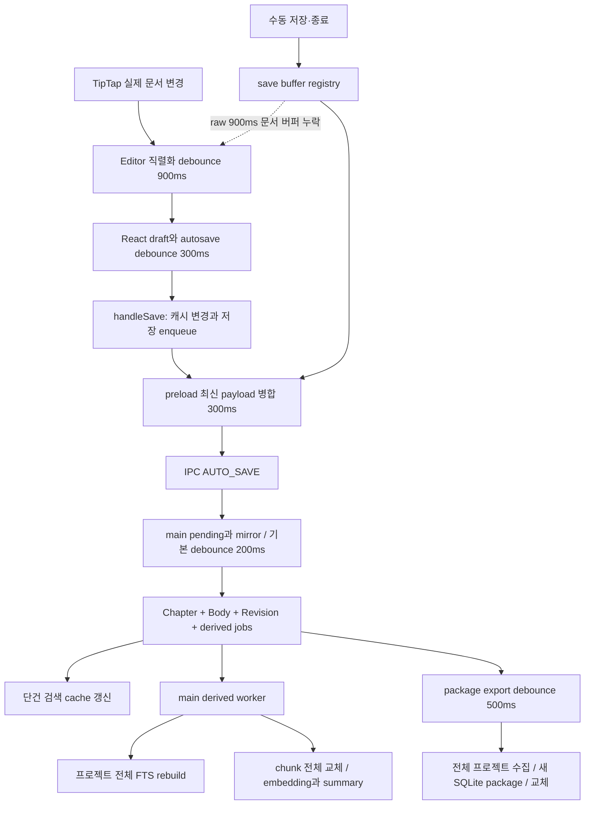

# Luie 크로스플랫폼 성능·저장·프로세스 심층 감사

2026-09-08 · 기준 commit `128d8be6` 및 현재 작업 트리 · macOS arm64

후속 [DB·저장 아키텍처 재검토](storage-architecture-review-2026-09-08.md)에서 파일 재열기의 최신 DB 덮어쓰기, package 단건 원자성, read/write 크기 제한 불일치를 추가 재현했다. 저장 영역의 착수 순서와 `.luie` 증분 설계는 후속 문서를 우선한다.

## 1. 종합 판정 — Risky

가장 큰 문제는 **작은 편집 하나가 프로젝트 전체 작업으로 확대되는 것**, **동기 작업이 main/renderer 실행 스레드를 점유하는 것**, **여러 비동기 계층의 최신 버전·완료·취소 조건이 일치하지 않는 것**이다. OS별 플래그나 worker 개수를 먼저 바꿔서는 이 문제를 해결할 수 없다. 저장 정확성을 먼저 고정하고, 불필요한 전체 작업을 줄인 다음, 남은 무거운 작업의 실행 위치를 바꾸는 순서가 필요하다.

기존 기반에는 유효한 개선도 많다. 본문과 목록 DTO 분리, 본문 캐시의 retain/generation/inflight 처리, preload 저장 병합, WAL, 패키지 원자 교체와 revision 확인, utility의 모델 분리, 화면 lazy load가 이미 있다. 이를 유지하며 실제로 깨진 경계를 수정하는 것이 가장 작은 해결책이다.

세 서브 에이전트가 DB/파일·renderer·main/OS를 독립 조사했고, 주 에이전트가 preload/IPC와 종단 흐름을 검토하고 재현·빌드 결과를 대조했다. 적용 지침: `senior-code-reviewer`, `ponytail`, renderer의 `vercel-react-best-practices`. 요청된 code-review-graph MCP가 이 세션에 제공되지 않아 범위를 좁힌 소스 탐색과 실제 호출부·테스트 대조를 사용했다.

상세 근거는 다음 네 문서에 있다. 항목 ID는 각 문서에서 사용한다.

| 문서 | 범위 |
|---|---|
| [DB·저장·검색·동기화](performance-audit-2026-09-08/database.md) | DB-01~14, transaction·FTS·chunk·revision·package·sync |
| [Renderer·에디터·메모리](performance-audit-2026-09-08/renderer.md) | R1~13, 입력·저장 전환·graph·diff·store·IME |
| [Main·utility·OS](performance-audit-2026-09-08/main-platform.md) | M01~12, startup·scheduler·모델·전원·배포 |
| [IPC·preload·측정 경계](performance-audit-2026-09-08/ipc.md) | I01~05, timeout·retry·로그·trace·검증 한계 |

`확정`은 코드 경로나 분리 재현에서 확인했다는 뜻이다. 실제 사용자 데이터 손실 발생 건수나 모든 OS의 성능을 측정했다는 뜻은 아니다. 합성 데이터의 시간은 문제 규모를 보여주는 근거이며 개선율 보장은 아니다.

### 기준과 조사 범위

현재 설치/선언 버전은 Electron 44.2.0, React 19.2.8, TypeScript 6.0.2, better-sqlite3 13.0.3, Vite 8.2.2, Vitest 5.0.0이다. `AGENTS.md`의 Electron 40/TS5 스냅샷과 다르므로 현재 소스를 기준으로 판단했다. 처음부터 존재한 `package.json`, `pnpm-lock.yaml` 변경을 보존했다.

tracked TS/TSX/JS/MJS/CJS/SQL 파일 기준 src/main 463개, preload 7개, renderer 526개, shared 127개, src/types 2개로 **1,125개/146,658줄**을 목록화했다. 관련 tests는 399개, scripts는 75개이며 배포 워크플로와 Supabase 경계도 조사했다. 목록화와 모든 줄의 수동 검토는 다르다. 주요 실행 경로를 종단 추적한 감사이며, 모든 SQL statement·OS 드라이버·클라우드 운영 설정까지 전수 검증한 것은 아니다.

### 현재 쓰기 경로

관련 소스: [Editor](../../src/renderer/src/features/editor/components/Editor.tsx), [handleSave](../../src/renderer/src/features/manuscript/hooks/useChapterManagement.ts), [preload](../../src/preload/index.ts), [autoSaveManager](../../src/main/manager/autoSave/autoSaveManager.ts).

일반 입력이 멈춘 뒤 기본 타이머만 합쳐도 `900 + 300 + 300 + 200 = 1,700ms`다. 이는 측정값이 아니라 소스상 대기 시간의 합이며, SQL/스케줄링/IPC/패키지 비용은 별도다. 설정 주석의 약 0.5초 목표는 앞단 타이머들을 반영하지 못한다. 900ms보다 짧은 간격으로 계속 입력하면 직렬화 타이머가 계속 밀리므로 미전달 raw draft가 존재하는 기간은 900ms보다 길 수 있다. 수동 저장이 이 지연을 안전하게 우회해야 한다.

## 2. 먼저 고쳐야 하는 문제

### 저장·최신성: 성능 변경 전에 보장해야 할 조건

| 우선순위 | 확인한 문제 | 실제 영향과 최소 조치 | 상세 |
|---|---|---|---|
| P1 | raw 문서의 900ms 버퍼가 저장 registry에 없음 | 즉시 저장/언마운트가 최신 입력을 놓침. raw document revision과 flush를 기존 registry에 연결 | R1 · 실제 Editor/hook 분리 재현 |
| P1 | split editor가 이전 chapterId를 버림 | A의 미저장 본문을 B로 전환할 때 B에 저장. wrapper에서 3번째 인자 보존 | R2 · 실제 wrapper/hook 재현 |
| P1 | main 저장 완료가 새 pending을 무조건 삭제 | A 저장 중 도착한 B가 사라진 상태로 saved 발송. 완료한 generation만 정리 | DB-01 · 실제 함수 재현 |
| P1 | 실패가 저장 성공 경로까지 전달되지 않음 | DB update 실패 후 옛 DB의 package export만 성공해도 수동 저장 성공 가능. flush가 실패/요구 revision을 검사 | DB-02 · 호출 경로 확인 |
| P1 | 같은 SQLite 연결에서 BEGIN 뒤 await | 다른 도메인의 성공한 SQL이 chapter rollback에 함께 취소. 동기 transaction 내부에 DB 변경만 묶기 | DB-03 · native SQLite + 실제 소스 재현 |
| P1 | derived 완료에 source generation 비교 없음 | 새 본문 B가 있는데 A의 chunks를 만들고 pending=0. claim/완료를 generation CAS로 연결 | DB-04 · 실제 소스 재현 |
| P1 | remote fetch에 pagination 없음 | 서버 행 상한을 넘으면 일부 결과를 전체로 취급. 안정적 cursor/Range로 완전 수집 | DB-07 · 서버 상한 조건부 |

실제 마지막 저장 호출도 확인했다. [useChapterManagement.ts:355](/Users/user/Luie/src/renderer/src/features/manuscript/hooks/useChapterManagement.ts:355)는 lastSavedRef를 먼저 갱신하고 `void api.autoSave(...)`의 실패를 로그만 남긴다. 따라서 상위 `useEditorAutosave`의 저장 성공·dirty 해제·재시도가 실제 enqueue 실패를 받지 못한다. 여기서 promise를 반환해도 main의 응답은 우선 enqueue 승인이다. **편집 버퍼 반영, 큐 접수, DB commit, package checkpoint를 각각 구분하고 수동 저장은 요구한 revision의 완료를 확인해야 한다.** preload의 실패 payload 보존이 있어 모든 경우를 영구 손실로 단정할 수는 없다.

DB-07의 1,000행 기준은 저장소 `supabase/config.toml`에 명시된 값이다. 운영 클라우드 설정은 확인하지 않았다. 서버가 설정된 상한까지만 응답한다면 현재 fetch는 뒤 페이지를 요청하지 않는다. [Supabase select 문서](https://supabase.com/docs/reference/javascript/select)

SQLite 트랜잭션은 연결에 귀속된다. async callback을 transaction helper에 그대로 감싸는 수정으로는 해결되지 않는다. 외부 비동기 준비를 끝낸 뒤 동기 SQL 블록을 실행해야 한다. [better-sqlite3 transaction 문서](https://github.com/WiseLibs/better-sqlite3/blob/master/docs/api.md#transactionfunction---function)

### 사용 중 멈춤을 만드는 큰 연산

| 우선순위 | 병목 | 비용이 커지는 이유 | 우선 수정 |
|---|---|---|---|
| P1 | chapter 하나 변경 후 전체 검색 rebuild | 직접 단건 cache upsert 뒤에도 모든 chapter를 다시 처리 | dirty sourceId만 갱신, 전체 rebuild는 명시 유지보수에 한정 · DB-05 |
| P1 | FTS의 반복 DELETE+INSERT | UNINDEXED chapterId scan과 개별 commit. rebuild의 id 탐색이 제곱으로 증가 | transaction과 prepared INSERT, 일반 테이블 rowid 매핑 · DB-06 |
| P1 | renderer force layout | 75/85회 × 모든 노드 쌍 비교 | worker로 이동·이전 요청 취소, 이후 알고리즘 비용 감소 · R4 |
| P1 | snapshot diff | 50k 문자 이하여도 토큰 차이가 많으면 수초 계산. selection에서도 재계산 | revision별 결과 재사용, 시간 제한과 worker · R5 |
| P1/P2 | SmartLink | 매 docChanged와 단순 자료 선택에도 전체 문서·decoration 재생성 | 의미 있는 store 변경만 재검색, 변경 textblock만 처리 · R3 |

`async`, `Promise.all`, `setTimeout`만으로 동기 CPU/SQLite 작업의 실행 스레드가 바뀌지 않는다. 현재 DerivedJobWorker도 이름과 달리 main에서 동작하는 interval 작업이다. 긴 작업은 main의 창·IPC 처리와 분리해야 한다. [Electron 성능 지침](https://www.electronjs.org/docs/latest/tutorial/performance), [Node 동기·비동기 파일 I/O](https://nodejs.org/api/fs.html)

## 3. 구조적 성능·메모리 문제

### SQL·파일·동기화

1. **불변 chunk의 embedding도 폐기한다.** source chunk 전체 DELETE와 새 UUID 생성으로 FK cascade가 기존 embedding을 지운다. 아래 계층의 hash 재사용 코드가 작동할 자료가 남지 않는다. content/index hash가 같은 chunk를 보존해야 한다. 동일 본문 재생성에서도 embedding=0을 재현했다. DB-08.
2. **자동 저장마다 전체 본문 revision을 누적한다.** ChapterRevision에는 runtime 보관 상한을 찾지 못했다. Snapshot retention은 별도라 이를 정리하지 않는다. 보관 정책을 정하고 변경량/시간 단위 revision으로 묶어야 한다. 감사 중 사용자 이력을 삭제하지 않았다. DB-09.
3. **작은 변경도 전체 `.luie` 파일을 다시 만든다.** 모든 본문·자료·snapshot·memory를 JS 객체와 JSON으로 만든 뒤 새 SQLite 파일에 동기 기록한다. snapshot 개수 제한도 모두 읽은 뒤 적용한다. SQL projection/limit과 변경 entry 범위를 먼저 줄이고 전체 checkpoint는 별도 실행 경로에서 처리한다. DB-10.
4. **변경 없는 sync도 비용을 낸다.** local/remote/merged bundle을 동시에 보관하고 동일 row까지 다시 UPDATE/POST한다. 동일 본문 UPDATE도 revision trigger와 package 저장을 유발할 수 있다. no-op sync의 DB write·package write·원격 upsert가 0이 되도록 우선 고친다. DB-11.
5. **job 조회 인덱스와 runnable 조건이 실제 쿼리에 맞지 않는다.** 전역 pending 조회에 projectId 선두 인덱스만 있고, LIMIT 뒤에 exhausted failed를 JS로 제거해 새 작업이 계속 밀릴 수 있다. runnable 조건을 SQL로 내리고 그 조건의 EXPLAIN에 맞춰 인덱스를 둔다. DB-12.
6. **키워드 출현마다 SQL을 반복한다.** 같은 인물 1,000회 등장에 appearance INSERT와 firstAppearance 조회가 반복된다. 고유 인물별 처리와 bulk transaction, committed content 기반 derived 작업이 필요하다. DB-13.
7. **저사양 검색 정책 일부가 실행부에 연결되지 않았다.** low-end의 lexical-hit 시 vector skip 값이 정의되어 있지만 utility 검색이 소비하지 않는다. 해당 모드의 query embedding 호출 수부터 검증한다. DB-14.

### Renderer·IPC

8. **CanvasMarkdownEditor는 입력마다 전체 텍스트·Markdown을 직렬화한다.** fallback getText도 선계산하고 selection마다 직접 forceUpdate한다. fallback lazy 평가와 필요한 toolbar 상태 구독부터 적용한다. R6.
9. **그래프 여러 항목 변경이 중간 전체 문서를 반복 저장한다.** 개별 삭제마다 목록 reload와 graph persist가 이어지고 queue closure가 각 snapshot을 보관한다. 사용자 한 동작을 한 batch로 묶고 최종 상태를 한 번 저장한다. R7.
10. **통계 worker 메시지에 대상과 request ID가 없다.** 여러 editor가 같은 worker의 모든 응답을 global stats에 쓴다. 활성 chapter/editor의 최신 응답만 반영해야 한다. worker를 여러 개 만드는 해결은 필요 없다. R8.
11. **프로젝트 이름 변경이 전체 초기화를 다시 실행한다.** effect가 project ID 대신 전체 객체에 의존해 5개 자료 reload와 본문 cache reset을 유발한다. 전환과 명시적인 복원 refresh를 분리한다. R9.
12. **renderer 첫 paint도 설정 IPC를 기다린다.** main의 첫 창 지연에 더해 renderer setup이 settings 완료를 기다리고, 이후 다시 읽는다. 별도 export/wizard 창에도 공통 초기화가 실행된다. 최소 shell과 필수 데이터의 경계를 줄인다. R10.
13. **RAG delta마다 전체 대화와 스크롤을 갱신한다.** 과거 메시지·근거 DOM까지 다시 렌더하고 session history 상한이 없다. 짧은 batch로 delta를 모으고 마지막 row만 갱신하며, history의 프로젝트별 수명과 페이지 처리를 정한다. R11.
14. **큰 자료 목록과 숨긴 탭도 DOM/구독을 유지한다.** 이는 의도된 상태 보존이며 곧바로 누수라고 부를 수 없다. 실제 규모가 큰 목록에 이미 설치된 가상화 도구를 적용하고 숨긴 탭의 비싼 계산을 중지한다. R13.
15. **IPC timeout은 원래 작업을 취소하지 않는다.** 15초 뒤 read를 재요청하면 두 작업이 겹친다. 다이얼로그도 같은 제한을 받아 늦은 정상 선택이 유실된다. 요청 수명, read single flight, 장기 job handle, cancel 전파를 구분해야 한다. I01~02.
16. **로그 배치에는 전체 in-flight 상한이 없다.** 1,000개 로그가 50개 동시 batch, batch 실패 후 1,000개 동시 fallback invoke로 확대되는 것을 재현했다. main에서도 로그마다 appendFile을 생성한다. 단일 bounded flush/sink와 rotation이 필요하다. I03/M08.
17. **IPC 구간을 연결할 trace가 없다.** preload UUID와 main UUID가 서로 다르고 main duration은 callback 진입 전 대기와 응답 복사를 제외한다. 같은 trace ID로 구간별 duration·payload bytes·queue depth를 측정해야 한다. I04.

contextBridge와 IPC에는 값 복사/직렬화 경계가 존재한다. 우선 본문 전송 횟수와 DTO 크기를 줄여야 한다. 모든 IPC를 공유 메모리로 바꾸는 제안은 현재 근거보다 복잡성이 크다. [Electron contextBridge](https://www.electronjs.org/docs/latest/api/context-bridge), [IPC 직렬화](https://www.electronjs.org/docs/latest/tutorial/ipc)

### Main·utility·백그라운드

18. **utility queue의 admission·취소 경계가 없다.** bridge timeout은 pending만 지우며 utility의 요청별 async 작업은 계속될 수 있다. 긴 generation과 짧은 status/stop을 같은 대기 조건에 묶지 말고 기존 signal을 실제 provider까지 연결한다. M01.
19. **provider cache가 갱신된 proxy 인증을 무시한다.** 동일 모델의 wrapper가 이전 Supabase token closure를 재사용한다. 실제 materializer를 제어한 재현으로 확인했다. proxy resolver를 최신화하거나 가벼운 HTTP wrapper를 재생성한다. M02.
20. **일반 재시작이 full readiness 검사에 묶인다.** 창 생성 전에 동기 integrity_check와 non-blocking으로 표시된 네트워크 세션 점검을 모두 기다린다. slow check에서는 TTL도 완료 전에 소진된다. 필수 연결 점검과 나중에 가능한 검사를 분리하고 TTL은 완료 시 계산한다. M03~04.
21. **sidecar가 health-ready 전에 running으로 보인다.** concurrent 요청이 시작 promise에 합류하기 전에 baseUrl을 받아 준비 전 서버에 접근할 수 있다. promise 검사 순서와 상태 변경 시점을 수정하면 된다. M05.
22. **idle에도 500ms DB polling이 계속된다.** macOS는 창을 모두 닫아도 프로세스와 worker가 남는다. enqueue wake와 empty backoff, 전원·visibility에 맞춘 background budget이 필요하다. M06.
23. **stop timeout을 drain 완료로 취급한다.** 5초 뒤에도 진행 중인 tick이 남아 DB close와 경합할 수 있다. tick promise·취소·재예약의 완료를 확인한 뒤 저장소를 닫아야 한다. 반대로 sidecar idle timer는 active request 수를 몰라 긴 요청도 종료 대상으로 삼을 수 있다. M07/M10.

## 4. 실제 운영·OS별 고려사항

### 이번에 얻은 수치

아래는 macOS arm64, Node v22.23.0의 분리 측정이다. Electron 앱의 FPS/저장 p99/Windows·Linux 속도로 일반화하지 않는다. graph/SmartLink는 워밍업 후 3회 median, diff와 FTS는 스트레스 입력의 개별 실행값이다.

| 관측 | 입력/조건 | 결과 |
|---|---|---|
| 실제 graphLayout 함수 | 500 / 1,000 / 2,000 nodes, 75회 | 123 / 359 / 1,444ms |
| 실제 단어 diff | 합산 45,778자, 서로 다른 토큰 각 4,000개 | 2,320ms; 현재 50k 제한 이하 |
| 실제 SmartLink/DecorationSet | 265,000자, 20,000 matches | 144ms |
| 합성 FTS rebuild | 1,200장 × 5,625 bytes, WAL/FULL | 현행 패턴 493.30ms; transaction+불필요 DELETE 제거 54.32ms |
| 합성 pending 조회 | 이력 100,000행/pending 10, 30회 평균 | 2.469ms; runnable partial index 후 0.013ms |
| full revision 누적 | 64KiB 본문 × 600회 | DB 39,665,664 bytes, 약 37.8MiB |
| 현재 소스 임시 production build | 기존 boot budget script | JS 573.1KiB/17개, CSS 166.1KiB, 통과 |

FTS·queue 수치는 **제품 수정 결과가 아니라 원인 확인을 위한 합성 SQL 비교**다. 제품에는 아직 적용하지 않았다. graph/SmartLink의 반올림된 0ms 소형 결과도 비용이 0이라는 의미는 아니다.

### 플랫폼 지원과 검증의 실제 차이

| 항목 | macOS ARM64 | macOS Intel | Windows x64 | Windows ARM64 | Linux x64 | Linux ARM64 |
|---|---|---|---|---|---|---|
| 배포 경로 | DMG 서명 CI | universal script, 독립 runtime CI 없음 | portable CI | portable CI | AppImage/deb 설정, CI 없음 | 명시 runtime CI 없음 |
| local llama 다운로드 map | 있음 | 있음 | CPU binary | 없음·unsupported | Ubuntu x64 binary | 없음·unsupported |
| 마지막 창 닫힘 | 프로세스 유지 | 프로세스 유지 | quit | quit | quit | quit |
| 이번 OS 실기 성능 검사 | 미실시; Node 분리 벤치만 | 미실시 | 미실시 | 미실시 | 미실시 | 미실시 |

근거: [sidecarConstants](../../src/main/infra/llm/sidecarConstants.ts), [electron-builder](../../electron-builder.json), [Windows workflow](../../.github/workflows/release-windows.yml), [macOS workflow](../../.github/workflows/release-macos.yml). Windows ARM64 앱을 배포하는 것과 해당 아키텍처에서 local LLM을 제공하는 것은 현재 일치하지 않는다. Windows x64의 gpuLayers 설정만으로 CPU용 binary가 GPU용으로 바뀌지도 않는다.

OS별 우선 검증은 다음과 같다.

- **macOS:** 창 없는 상태의 idle CPU/wakeups, App Nap과 background 작업, 절전/복귀, Apple Silicon의 CPU/GPU 통합 메모리, Intel 별도 실행. Metal/GPU 효율은 실제 제공 binary와 기기로 확인한다.
- **Windows:** x64/ARM64 packaged native load, Defender/동기화 폴더의 파일 교체 지연과 잠금, 긴 경로·UNC, Microsoft IME. GPU runtime은 지원 backend와 driver를 감지하고 CPU fallback을 제공하는 범위에서 선택한다.
- **Linux:** AppImage/deb의 native library와 glibc 호환, Wayland/X11, IBus/Fcitx, 배포판별 file dialog, suspend/resume. macOS와 같은 배터리·thermal 이벤트를 제공한다고 가정하지 않는다.
- **공통:** 조합 중 Enter를 무시하지 않는 RAG composer 경로(R12), 저장 도중 창 닫기/종료 취소/절전, 느린 디스크·외장 볼륨·DB lock·모델 cold start를 같은 fixture로 검사한다.

전원 이벤트의 지원 OS는 기능마다 다르므로 capability 확인 후 연결해야 한다. [Electron powerMonitor](https://www.electronjs.org/docs/latest/api/power-monitor)

### 저수준 최적화에서 유지할 원칙

- SQLite `synchronous=FULL`과 fsync를 일괄 제거하지 않는다. canonical 데이터와 재생성 가능한 cache의 내구성 요구를 분리한 다음 transaction·write amplification을 먼저 줄인다. cache의 설정 변경은 현재 startup PRAGMA 검사와 복구 계약도 함께 조정해야 한다. [SQLite PRAGMA](https://www.sqlite.org/pragma.html#pragma_synchronous)
- 현재 main의 `busy_timeout=5000`, integrity_check, 큰 동기 transaction은 이벤트 루프 점유 후보다. lock 시간과 checkpoint duration을 측정한다. 단순 timeout 상향으로 처리량을 해결하지 않는다.
- worker/thread/process 수를 코어 수만큼 늘리지 않는다. DB write owner와 순서를 고정하고 LLM·embedding·foreground 입력의 CPU/RAM budget을 나눈다. `threads=4`, cacheRam 2,048MiB는 현재 옵션값이며 실제 RSS 할당량을 뜻하지 않는다.
- 메모리는 renderer/main/utility/llama별 JS heap, native/external/ArrayBuffer, private working set, model/KV/GPU를 구분한다. shared page가 있는 RSS 합계는 실제 물리 메모리를 중복 계산할 수 있다. 긴 세션에서 증가 기울기와 GC 뒤 잔존량을 함께 본다.
- 큰 벡터 전송의 boxing/복사 비용이 측정되면 typed array와 명시적인 transfer 경로를 검토한다. 현재 persisted vector 전량을 JS로 가져와 계산하는 fallback은 확인되지 않았다. 실제 기본 RAG는 utility의 native scalar cosine 검색이다.
- 전역 GPU blacklist 무시, contextIsolation/sandbox 해제, backgroundThrottling 일괄 해제, 무조건 `UV_THREADPOOL_SIZE` 확대, 새 native/SIMD/ANN 모듈 추가를 현재 해결안으로 삼을 근거는 없다.

## 5. 실행 가능한 수정 순서와 검증

### 1단계 — 저장 정확성과 요청 수명

R1/R2, DB-01~04를 먼저 고친다. 원고 version과 chapterId를 raw editor → enqueue → DB commit → package checkpoint까지 보존한다. 수동 저장은 실패를 전달하고, worker 완료는 처리한 source generation이 최신인지 검사한다. utility에서는 기존 requestId/signal로 timeout→cancel→settle을 연결한다.

완료 기준: 즉시 Ctrl/Cmd+S·연속 입력 후 전환·저장 중 재입력·DB 실패·종료 취소에서 마지막 입력과 대상 chapterId가 보존된다. unrelated domain write가 다른 transaction 실패에 취소되지 않는다. 새 source를 처리하지 않은 job이 completed로 끝나지 않는다.

### 2단계 — 같은 일을 반복하는 비용 제거

DB-05/06/08/09/11/12/13, R3/R7/R9와 I03을 고친다. 단건 FTS, bulk transaction, 불변 chunk 보존, 올바른 runnable SQL, 의미 있는 store 변경만 처리, graph 최종 상태 1회 저장을 적용한다. revision 보관은 복구 요구와 함께 정한다.

완료 기준: 한 chapter 수정 시 관련 없는 chapter의 FTS/embedding을 다시 쓰지 않는다. no-op update/sync가 불필요한 write를 만들지 않는다. SQL/commit 수와 log queue depth가 입력 규모·실제 변경량에 맞는다.

### 3단계 — 남은 무거운 연산의 위치 변경

renderer의 graph/diff는 기존 순수 함수를 worker에서 실행하고 최신 request 결과만 반영한다. package 전체 checkpoint·큰 index/maintenance는 main의 창/IPC 처리와 분리한다. 기존 utility/worker 기반을 재사용하되 LLM 장기 연산이 DB 제어 요청을 막지 않도록 작업 소유권을 정한다. 모든 단건 SQL을 무조건 IPC로 바꾸는 전면 개편은 피한다.

권장 경계: renderer는 입력과 화면, preload는 검증된 API와 요청 수명, main은 창·OS·권한·수명 조정, 데이터 작업 소유자는 완결된 DB transaction/큰 batch, 기존 모델 utility는 inference와 sidecar 수명을 맡는다. transaction 내부 statement를 여러 IPC 호출로 쪼개지 않는다.

완료 기준: graph/diff/checkpoint가 진행 중이어도 입력과 창·IPC 처리가 응답한다. 일반 변경 저장은 관련 없는 package entry를 다시 쓰지 않으며, 전체 checkpoint의 원자 교체와 revision 확인은 유지한다.

### 4단계 — OS/하드웨어별 예산과 회귀 검증

새 benchmark 프레임워크보다 기존 fullprod/stress/save-latency를 확장한다. artifact hash, Electron/Node/SQLite 버전, OS/arch/CPU/RAM/전원 상태, fixture 크기를 함께 기록한다. userData까지 격리한 clean packaged 앱으로 실행한다.

| 시나리오 | 반드시 볼 지표 |
|---|---|
| cold/warm 시작, 오프라인 시작 | 첫 창·첫 React paint·editor ready, 단계별 critical path |
| 5k/50k/250k 원고와 한글·일본어 입력 | key→paint p50/p95/p99, long task, serialization·SmartLink 시간 |
| 100/500/1,000/2,000 노드 | layout wall time, 계산 중 입력 반응, pan/zoom frame, stale 작업 수 |
| 300/1,200장 저장과 sync | enqueue/commit/checkpoint 각각의 지연, SQL/commit 수, WAL/DB/package bytes |
| idle 10분·창 없음·절전 복귀 | CPU/wakeups, runnable poll 횟수, private memory 증가, 재개 정확성 |
| model cold/warm·느린 provider | queue depth, cancellation latency, active count, chat/embedding 자원 경쟁 |
| 닫기/전환 반복과 대화 장기 사용 | listener·worker·timer 수, retained objects, history/캐시 bytes |

입력 p95 16ms 이내, main/renderer의 지속적인 50ms 초과 task 제거 같은 목표를 출발점으로 삼을 수 있으나, 이는 **제안 목표**다. 저장 p95와 RAM 상한은 장치 등급·프로젝트 규모·내구성 단계별 baseline을 먼저 얻어 설정해야 한다. 이번 조사로 목표 달성이나 특정 비율의 개선을 인증하지 않았다.

### 실제 실행 결과

| 검사 | 결과와 의미 |
|---|---|
| 기존 IPC/preload/handler suite | 5개 파일 / 29개 테스트 통과 |
| 기존 renderer 저장·캐시·통계 suite | 5개 파일 / 34개 테스트 통과 |
| 기존 main/lifecycle/sidecar suite | 7개 파일 / 20개 테스트 통과 |
| 분리 재현 | raw editor flush, split chapter target, pending 삭제, transaction 혼입, job 세대 손실, embedding 폐기, sidecar ready/token/TTL, IPC retry/dialog/log 현상 확인 |
| 현재 작업 트리 production build | 임시 out에 main/preload/renderer 빌드 성공 |
| 현재 빌드 render boot budget | JS 573.1KiB ≤600, CSS 166.1KiB ≤170, 통과 |
| TypeScript 전체 검사 | 기존 Sidebar.tsx:157의 unused `handleRenameProject` TS6133 한 건으로 실패 |
| preload 계약·handler schema gate | 통과 |
| IPC contract map gate | 문서 drift 발견. 검사 도구가 만든 변경만 복원, patch를 임시 보관 |
| pnpm 실행 | registry 접근/서명 검증 오류로 실패; 설치된 로컬 runner로 해당 검사를 직접 실행 |
| full qa:core·실앱 OS profiler | 전체 실행하지 않음. 위 항목을 전체 통과로 표현하지 않음 |

기존 테스트는 총 **83개 통과**했다. 분리 재현은 제품이 안전하다는 테스트가 아니라 현재 결함이 나타나는 조건을 확인한 관측 검사다. 정식 수정 때 기대값을 정상 동작으로 바꾸고 관련 integration regression으로 편입해야 한다.

빌드는 `node node_modules/electron-vite/bin/electron-vite.js build --outDir /private/tmp/luie-audit-build/out`으로 실행했다. 저장소의 기존 `out`은 현재 소스와 달랐으며, 기존 1,108.9KB 부트 초과를 현재 결함으로 보고하지 않는다. 새 빌드에는 manuscript barrel의 `INEFFECTIVE_DYNAMIC_IMPORT` 경고가 남지만 부트 예산은 통과한다.

명령·fixture·JSON·mock 경계는 각 상세 보고서에 있다. 재현 스크립트는 `/private/tmp/luie-*-repro.cjs`, `/private/tmp/luie-main-probes.cjs`, `/private/tmp/luie-ipc-audit/`, `/private/tmp/luie-renderer-audit/`에 보존했다. 이는 세션 임시 산출물이므로 장기 보관하려면 함께 보관해야 한다. 사용자 앱·DB·외부 모델 서버를 기동하거나 native rebuild·배포를 실행하지 않았다.

## 6. 후순위 개선과 남은 확인

- logger의 순환 배열/깊이·크기 처리, synopsis cache 보관 상한, performance.measure 누적은 보강 대상이다. 핵심 저장/전체 재처리 문제보다 먼저 대형 구조를 만들 필요는 없다.
- cache 엔트리 수와 bytes 상한은 다르다. 현재 본문 LRU·retain을 무시하고 활성 문서를 내보내면 IPC 재조회가 증가한다. 정확한 retained bytes를 보고 조정한다.
- vector exact scan의 O(N×D) 비용, layout spatial approximation, chunk별 증분 통계, 이미지 원문과 decode bitmap 중복은 큰 데이터에서 profile 후 선택한다.
- 클라우드 PostgreSQL의 실 운영 EXPLAIN·RLS·index, 모든 memory/eval SQL, OS별 heap snapshot·GPU·disk latency는 이번 감사에서 전수 확인하지 않았다. 원격 데이터가 늘 때의 sync merge/CAS와 native 파일 교체의 crash 내구성도 실환경 검증이 남았다.
- 보안 경계, 입력 검증, 원자 저장, 실패 시 복구를 유지한다. 지금 가장 큰 개선 여지는 새 의존성이나 저수준 재작성보다 **변경 범위 축소와 정확한 작업 수명 관리**에 있다.
