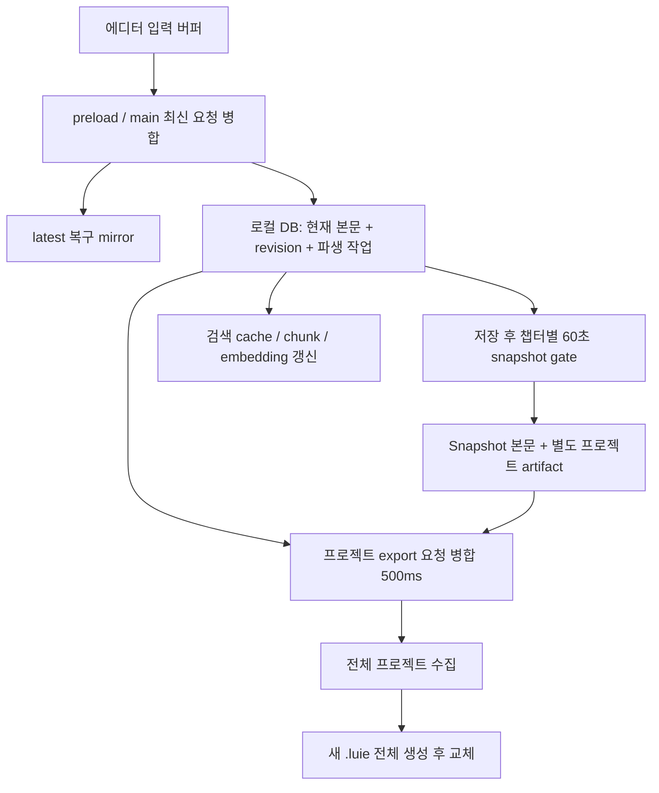
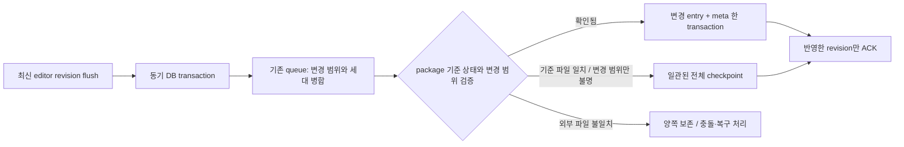

# DB·저장 아키텍처 재검토

2026-09-08 · commit `128d8be6` 및 현재 작업 트리 · 구현 변경 전 설계 감사

## 1. 종합 판정 — Risky

**D부터 진행한다. 첫 작업은 저장 원본 선택·commit·복구 보장이며, 이어서 `.luie`의 변경 범위를 줄인다.** FTS 튜닝이나 프로세스 이전을 앞세우지 않는다. 재조사에서 최신 DB 본문이 오래된 `.luie`를 명시적으로 다시 여는 동작에 덮이는 경로를 실제 DB·파일·서비스로 추가 재현했다.

저장 로직은 바꿀 필요가 있다. 그러나 JSON으로 되돌리거나 `.luie` 포맷과 모든 DB를 다시 설계할 필요는 아직 없다. 현재 SQLite 컨테이너와 export queue를 유지하면서, 저장 완료 조건을 고정하고 검증된 변경 집합을 한 transaction으로 반영하는 방향이 가장 작다.

서브 에이전트 3명이 package writer/비용, 원본 선택/복구, snapshot/이력 구조를 나눠 재검토했다. 주 에이전트는 변경 범위 추적, 실제 DB 손실 복원, stale package 재열기, 테스트 계약을 확인했다. `senior-code-reviewer`, `ponytail` 지침을 적용했고, code-review-graph MCP는 세션에 제공되지 않아 scoped 소스 탐색을 사용했다. 제품·기존 테스트 코드와 사용자 데이터는 수정하지 않았다.

상세: [package 구조·비용](storage-architecture-review-2026-09-08/package.md), [원본 선택·복구·증분 조건](storage-architecture-review-2026-09-08/authority.md), [snapshot·이력·cache](storage-architecture-review-2026-09-08/history.md). 기존 DB-01~14는 [앞선 DB 감사](performance-audit-2026-09-08/database.md)를 참조한다.

### 왜 SQLite로 바꿨는데 전체 파일을 다시 쓰는가

현재 `.luie`의 SQLite schema는 프로젝트의 `Chapter`/`Character` 테이블이 아니다. `LuieContainerEntry(path TEXT PRIMARY KEY, content TEXT, createdAt, updatedAt)`에 기존 논리 파일을 저장한다.

| entry | 현재 내용 | 변경 단위 |
|---|---|---|
| `manuscript/{chapterId}.md` | 한 챕터의 원문 | 챕터 1개 |
| `meta.json` | 프로젝트 정보와 전체 챕터 목록 | 프로젝트 metadata |
| `world/*.json` | 인물/용어/graph/문서 등의 JSON | 해당 collection/document |
| `memory/canonical.json` | 보존 대상 memory의 JSON | canonical memory 묶음 |
| `snapshots/index.json` | 본문까지 포함한 snapshot 배열 | 선택된 snapshot 전체 |
| `snapshots/{id}.snap` | index에도 있는 동일 snapshot | 개별 snapshot |

즉 챕터는 이미 분리된 행이다. SQLite가 전체 파일 재작성을 요구하는 것이 아니다. [export engine](../../src/main/services/core/project/projectExportEngine.ts:71)이 전체 project payload를 만들고, [full writer](../../src/main/services/io/luieSqliteContainer.ts:214)가 **새 임시 SQLite 파일 → 모든 entry INSERT → close → 기존 파일 교체**를 실행하기 때문이다. 변경된 chapter ID를 exporter에 넘기는 계약도 없다.

전체 JSON/ZIP 시절의 내보내기 흐름을 SQLite 행에 옮겼지만, 빈번한 저장을 증분 UPDATE로 전환하는 단계가 남은 상태다. JSON을 SQLite의 TEXT에 넣는 것 자체가 잘못은 아니다. 자주 바뀌는 원고가 이미 개별 행인데도 모두 다시 만드는 것이 우선 문제다.

### 현재 저장 흐름과 “나중에 합친다”의 의미

합쳐지는 것은 **아직 실행하지 않은 요청**이다. 여러 변경분을 작은 delta로 기록했다가 나중에 병합하는 저장 구조는 아니다. main autosave는 기본 200ms, project export는 500ms debounce다. export 중 새 revision이 생기면 전체 export를 다시 실행할 수 있다. 자동 snapshot 생성도 export를 예약하므로 실행 시점에 따라 기존 요청과 합쳐지거나 후속 전체 export가 된다.

사용자 snapshot, 내부 ChapterRevision, `.luie` checkpoint, SQLite WAL checkpoint는 서로 다르다. Ctrl/Cmd+S는 최신 저장을 flush하고 package를 반영하는 동작이며, 수동 이력 snapshot을 만든다는 뜻은 아니다. SQLite WAL checkpoint 역시 사용자 원고 이력 기능이 아니다.

## 2. 필수 수정: 저장 정확성과 복원 가능성

### S-01 · P1 · 미반영 DB 변경이 명시적 파일 재열기에 덮인다 — 새 실제 재현

[projectImportOpen.ts:243](../../src/main/services/core/project/projectImportOpen.ts:243)는 `Project.updatedAt > package.meta.updatedAt`일 때만 DB가 더 최신이라고 보호한다. [chapter write](../../src/main/services/core/chapter/chapterWriteOperations.ts:235)는 chapter/body를 변경하지만 Project.updatedAt를 갱신하지 않는다. [DB trigger](../../src/main/database/main/projectRevisionTriggerSql.ts:108)는 project revision만 올린다. 파일에 아직 반영하지 않은 revision이 있는지는 이 선택 조건에서 확인하지 않는다.

실제 서비스·native SQLite·임시 `.luie` 결과:

| 단계 | 본문 | DB revision / exportedRevision |
|---|---|---|
| 최초 checkpoint | A | 5 / 5 |
| B의 DB commit, package는 아직 A | B | 7 / 5 |
| 같은 `.luie`를 명시적으로 열기 | **A로 되돌아감**, `conflict=luie-newer` | **9 / 9로 clean 표시** |

실험에서는 export 예약 함수만 보류해 정상 500ms 대기 구간을 결정적으로 만들었다. import, DB transaction, 파일 읽기/쓰기는 실제 구현이다. 일반 최근 프로젝트 선택은 DB 객체를 여는 다른 경로이므로 이 문제를 모든 프로젝트 전환에 일반화하지 않는다. 재현: [stale-open 관측](storage-architecture-review-2026-09-08/evidence/stale-open-observation.json).

최소 조치: local uncheckpointed revision/pending을 확인하고, 사용자가 이전 파일 복원을 명시한 경우와 일반 파일 열기를 분리한다. 불확실한 두 원본을 timestamp만으로 덮어쓰지 않는다. `Project.updatedAt` 한 군데를 보정하는 것만으로 clock skew·외부 파일 교체·부분 저장까지 해결되지는 않는다.

### S-02 · P1 · 기존 단건 writer를 그대로 연결하면 부분 commit이 남는다 — 새 실제 재현

[writeLuieSqliteEntry](../../src/main/services/io/luieSqliteContainer.ts:291)는 chapter entry, meta entry, container info를 각각 별도 statement로 쓴다. 전체를 묶는 transaction이 없다. 실제 writer에 SQLite 실패 trigger를 주입했을 때:

- metadata 쓰기 실패: 함수는 reject하지만 **새 chapter 본문만 이미 commit**됐다.
- container info 쓰기 실패: **새 본문과 metadata만 commit**되고 info는 이전 값이다.

따라서 full exporter를 단건 API 반복 호출로 교체하는 수정은 부적절하다. 변경 entry들·삭제 entry들·meta·container info를 **하나의 동기 SQLite transaction**에 넣는 batch 경계가 먼저다. [실패 주입 결과](storage-architecture-review-2026-09-08/evidence/package-atomicity-results.json)

이 API는 미래 증분 저장 후보일 뿐 아니라 현재 세계관 문서의 `FS_WRITE_PROJECT_FILE` 경로에서도 쓰인다. [fsPackageOperations.ts:208](../../src/main/handler/system/fs/fsPackageOperations.ts:208) → 실제 단건 writer로 연결된다. 따라서 원자성 문제는 해당 기존 경로까지 함께 수정해야 한다.

### S-03 · P1 · 저장에 성공한 entry를 같은 앱이 읽지 못한다 — 새 실제 재현

[package reader](../../src/main/services/io/luieSqliteContainer.ts:198)는 entry당 5MiB, package 전체 256MiB 상한을 검사한다. full writer는 같은 상한을 검사하지 않고, 단건 writer도 기존 package 크기만 확인한 뒤 새 내용을 쓴다.

ASCII 5MiB+1, 즉 **5,242,881 bytes**의 chapter를 실제 full/단건 writer 각각에 넣으면 저장은 성공하지만, 같은 앱의 reader는 `FS_2001: entry is too large`로 거부했다. 파일 전체는 약 5MiB여서 256MiB 상한과 무관하다. [크기 경계 결과](storage-architecture-review-2026-09-08/evidence/package-size-limit-results.json)

개별 원고뿐 아니라 snapshot 전체 본문 배열과 canonical memory도 한 entry이므로 합계가 커지면 같은 제한에 걸릴 수 있다. import collections는 읽기 실패를 전파하므로 이 경우를 “빈 snapshot으로 정상 import된다”고 단정하지 않는다. 실제 재현은 chapter entry의 write/read 경계까지다.

최소 조치: 쓰기 전 허용 범위를 검사해 이전 정상 파일을 보존하고, 최종 생성 크기도 교체 전에 확인한다. 장기적으로 큰 collection을 분리한다면 포맷·reader를 함께 변경한다. 제한값만 무조건 높이는 것으로 메모리 문제까지 해결했다고 판단하지 않는다.

### 기존 DB-01~04도 같은 저장 계약 안에서 처리

- 처리 중인 A 저장 완료가 이후 도착한 B pending을 삭제하지 않아야 한다.
- DB 실패가 flush/manual save 성공으로 변하지 않아야 한다.
- 공유 SQLite connection의 `BEGIN`과 `COMMIT` 사이에 `await`로 다른 도메인 SQL이 섞이지 않아야 한다.
- 파생 작업의 완료는 실제 처리한 source generation을 조건으로 해야 한다.

SQLite는 서로 다른 연결 사이를 격리하지만 같은 연결의 서로 다른 비동기 작업을 격리하지 않는다. 준비 작업을 먼저 끝내고 동기 SQL transaction을 실행해야 한다. [SQLite isolation](https://www.sqlite.org/isolation.html)

DB부터 시작해도 에디터의 raw buffer flush와 chapterId 보존은 최종 수동 저장 검증에 포함한다. main에 전달되지 않은 입력은 DB의 내구성으로 구할 수 없다. UI 전반 재설계와는 별개인 저장 경계 수정이다.

## 3. 구조적 문제: 무엇이 원본이고 무엇이 cache인가

| 저장소 | 현재 역할 | 지워도 재생성 가능한가 |
|---|---|---|
| main SQLite의 Chapter/Body·세계관·보존 memory | 현재 작업 상태, 아직 package에 없는 commit 포함 | **전체를 cache 취급해 삭제하면 안 됨** |
| `.luie` | 이동·DB 재구성을 위한 마지막 package 상태 | 최신 DB commit과 동일하다는 보장이 필요 |
| 별도 cache SQLite의 search/appearance/FTS | 검색·출현 위치의 파생 표현 | 원본이 있고 invalidation/rebuild가 정확하면 가능 |
| main DB의 chunks/embeddings/jobs/summary 등 | memory 파생 데이터·실행 상태 | 정책상 재생성 대상이지만 계산 비용과 최신성 확인 필요 |
| confirmed/rejected memory 및 근거 | 보존 대상 판단·사실 | 단순 cache 아님; package export 대상 subset 존재 |
| latest mirror | main에 접수됐으나 DB commit 전일 수 있는 본문 | 유일한 최신 복구본일 수 있어 임의 삭제 불가 |
| Snapshot / 외부 artifact / ChapterRevision | 서로 다른 이력·복구 계층 | 소비자·보존 계약 확인 전 감축 금지 |

[current-main.md:177](../architecture/current-main.md:177)의 “.luie canonical, DB는 재구성 가능한 cache”는 마지막 checkpoint 이후 구간을 설명하기에 부족하다. detached 프로젝트는 package 자체가 없을 수도 있다. 권장 명칭은 **로컬 작업 DB, 휴대 가능한 package checkpoint, 재생성 가능한 검색 cache**다.

### 스냅샷은 현재 비용과 보장 범위가 맞지 않는 부분이 있다

1. **ChapterRevision**: content 저장마다 전문 append, runtime restore/prune/export 소비자를 찾지 못했다. 현재 본문도 Chapter와 ChapterBody에 중복된다. 이력을 바로 지우지 말고, 보존해야 할 과거 자료와 새 append의 필요를 먼저 결정한다.
2. **Snapshot DB**: 저장 후 챕터별 60초 gate가 있으며 첫 저장도 생성 대상일 수 있다. 별도 프로젝트 주기 scheduler는 구현돼 있지만 production 연결을 확인하지 못했다.
3. **외부 artifact**: 개별 chapter snapshot이어도 활성 프로젝트 본문과 인물/용어 등을 다시 모아 JSON→gzip하고 동일 buffer를 최대 3곳에 쓴다. `FullSnapshot`이라는 이름과 달리 현재 세계관·canonical memory 전체를 보존하지 않는다.
4. **package snapshot**: 기본 최근 50개를 넣지만, SQL은 더 많은 snapshot을 모두 읽은 뒤 제한한다. 본문은 index와 개별 `.snap`에 중복된다. 현재 importer는 index의 본문을 읽으므로 index를 metadata-only로 먼저 바꾸면 빈 본문 복원이 가능하다.
5. **보관 차이**: DB의 project 단위 2,000개 cap은 MANUAL을 제외하지 않는다. 시간 prune은 AUTO를 대상으로 하므로 정책이 다르다. package export/import는 MANUAL/AUTO type도 보존하지 않는다.
6. **복구 발견**: 외부 artifact의 focus 본문은 미리보기에 쓰이지만 복원은 DB에서 캡처한 chapters를 사용한다. DB에 없는 snapshot ID를 orphan으로 삭제하는 cleanup은 DB 손실 후 독립 backup과 충돌할 수 있다. 두 항목은 소스 경로에서 확인한 위험이며 이번 실제 crash 시험 결과는 아니다.

이 계층들을 한 번에 없애지 않는다. 먼저 **최신 입력 복구, 사용자가 만든 이력, 독립 프로젝트 backup**의 목적과 보존 범위를 구분하고 각각 읽기·복원 검사를 만든다. 상세 조건·caller·retention은 [이력 보고서](storage-architecture-review-2026-09-08/history.md)에 있다.

## 4. 실제 비용과 운영 조건

### 실제 writer 비용 측정

현재 `writeLuieContainer`/단건 entry API를 실행했다. macOS arm64, Node v22.23.0, native SQLite, 임시 합성 데이터이며 장당 64KiB, snapshot 20개다. 한 chapter의 1바이트를 바꿔 각 경로를 3회 실행한 median이다.

| 챕터 수 | package 크기 | 현재 전체 writer | 현재 단건 writer | 전체 재삽입 / 단건 갱신 entry |
|---|---:|---:|---:|---:|
| 50 | 5.69MiB | 12.32ms | 1.22ms | 81 / 2 |
| 250 | 18.33MiB | 25.37ms | 1.31ms | 281 / 2 |
| 1,000 | 65.70MiB | 80.91ms | 2.97ms | 1,031 / 2 |

1,000장 사례에서 full 경로는 **68,281,159 bytes의 논리 entry content**를 다시 삽입하고 새 inode로 교체했다. 단건은 본문+meta **183,335 bytes**를 갱신하고 기존 inode를 유지했다. 이것은 커널의 물리 쓰기 바이트나 SSD 수명 측정이 아니다. 단건도 전체 chapter 목록 metadata를 다시 쓰므로 완전한 상수 비용이 아니다.

계측에는 DB에서 전체 project를 수집하는 비용, main의 다른 저장·검색·snapshot 작업, 실제 Electron UI 지연이 포함되지 않는다. 계측 wrapper의 추가 비용과 page cache 효과도 있다. 단건 API는 S-02의 원자성 문제가 있으므로 이 표를 “안전한 최종 구현이 27배 빨라진다”는 보장으로 읽으면 안 된다. **전체 재작성 없이 같은 container에서 훨씬 작은 범위의 쓰기가 가능하다는 근거**다. [원시 결과](storage-architecture-review-2026-09-08/evidence/package-cost-results.json)

### 비용이 커지는 위치

원고 한 장 길이 C, 전체 현행 프로젝트 P, DB 전체 snapshot 전문 합 H_all, export하는 snapshot 전문 합 H_export, commit 횟수 S로 보면:

- 일반 DB 저장: 현행 본문 이중 기록 + 전문 revision으로 본문 기록량이 C에 비례한다. revision 누적은 O(S×C).
- 일반 package export: LIMIT 전 전체 snapshot을 읽으므로 수집 비용은 대략 O(P+H_all), 직렬화·기록 비용은 O(P+H_export)다. 기록할 snapshot 본문은 두 번 포함한다.
- 자동 snapshot artifact: 해당 장만의 이력을 만들더라도 프로젝트 본문 전체 수집·압축 비용이 든다. 저장 위치별 파일 쓰기도 추가된다.
- 검색: 앞선 DB-05/06처럼 단일 장 변경이 전체 FTS rebuild로 확대된다.
- 일부 세계관 문서 저장: [worldReplicaService](../../src/main/services/features/worldReplica/worldReplicaService.ts:56)가 DB 저장 후 즉시 전체 package export를 시도하고, [renderer worldPackageStorage](../../src/renderer/src/features/research/services/worldPackageStorage.ts:452)가 성공 뒤 해당 entry를 다시 쓴다. 원고 export와 달리 단건 API도 쓰지만, 정상 경로에서는 전체 저장에 추가되는 중복 쓰기다. 해당 경로도 package write 소유자를 하나로 모아야 한다. 이는 호출 경로 확인이며 별도 UI 시간 측정은 하지 않았다.
- peak memory: DB 결과·DTO·JSON 문자열·압축 buffer·SQLite native cache 등이 일부 동시에 존재한다. byte 상한과 실제 생존 시점을 측정해야 하며 이번 벤치로 process peak RSS를 측정했다고 주장하지 않는다.

새 프로세스로 옮기면 main 멈춤은 줄일 수 있어도 전체 디스크 기록량은 그대로다. 변경 범위부터 줄이고 남은 큰 작업을 분리한다.

### `.luie` 직접 갱신의 OS·복구 계약

기존 package는 DELETE journal + FULL을 사용한다. 이를 바로 WAL로 바꾸면 `.luie`만 복사했을 때 마지막 commit이 빠질 수 있다. WAL 파일은 데이터베이스의 영속 상태 일부다. [SQLite WAL](https://www.sqlite.org/wal.html)

DELETE journal도 transaction 중이나 crash 뒤에는 복구 journal이 필요할 수 있다. 정상 commit·close 후 단일 파일을 전달하는 것과, 쓰는 도중 Explorer/Finder/동기화 프로그램이 파일만 복사하는 것은 다른 상황이다. in-place update는 후자의 위험 구간을 만든다. 앱의 복사·Save As·backup은 writer가 멈춘 상태나 SQLite가 지원하는 일관된 복사 경로를 사용해야 한다. [SQLite 파일 복사와 journal](https://www.sqlite.org/howtocorrupt.html), [atomic commit](https://www.sqlite.org/atomiccommit.html)

현재 package reader는 readonly로 열고, meta read의 비legacy 오류를 corrupt로 분류한다. hot journal 복구가 필요하면 readonly 열기는 `SQLITE_READONLY_ROLLBACK`으로 실패할 수 있다. 증분 갱신을 일반 저장 경로에 넣기 전에 writer 소유권 아래 복구한 뒤 읽는 절차가 필요하다. [SQLite 결과 코드](https://www.sqlite.org/rescode.html#readonly_rollback)

macOS 외장/동기화 폴더, Windows 파일 잠금·Defender·공유 폴더, Linux 파일시스템·권한에서 같은 fixture로 commit/강제 종료/재열기를 검증한다. JS 예외 주입 성공과 실제 전원 손실 내구성 인증은 다르다. fsync를 없애거나 내구성 설정을 일괄 약화하지 않는다.

## 5. 권장 설계와 작업 순서

### 유지할 구조와 변경할 경계

**로컬 작업 DB + SQLite `.luie` + 기존 ProjectExportQueue를 유지한다.** 전체 exporter도 초기 생성·Save As·복구·변경 범위를 모르는 경우의 안전한 경로로 남긴다. 일반 저장에는 변경 집합을 한 transaction으로 package에 반영하는 경로를 추가한다.

전체 경로로 돌아가는 것은 해당 변경의 원본이 DB/지원 payload에 모두 보존된 경우에 한한다. generic 파일 API로 package에만 기록한 내용이나 exporter가 모르는 entry는 기존 full writer에서 제외될 수 있다. 이런 경우도 자동 재작성 대신 기존 파일을 보존하고 명시적으로 병합·복구한다.

이 단계에 별도 event-sourcing DB, 커스텀 WAL, delta 전용 포맷은 필요하지 않다. 다만 **마지막 reason이 chapter:update라는 이유만으로 부분 저장을 허용해서는 안 된다.** 다른 세계관·memory·snapshot write도 project revision을 올린다. 그 변경을 빠뜨리고 최신 project revision을 ACK하면 crash 복구에 필요한 revision gap까지 사라진다.

필수 계약:

1. commit 전후 revision과 변경 scope를 같은 쓰기 경계에서 확보한다. 패키지 기준 revision부터 목표까지 모든 변경이 관측됐을 때만 증분 경로를 허용한다.
2. 현재값을 임의의 여러 시점에서 모으지 않고 일관된 읽기 상태를 만든다. mutation의 async 준비를 transaction 밖에서 끝내고 동기 읽기/쓰기 경계를 유지한다. package import도 여러 entry를 각기 다른 연결에서 읽는 대신 같은 read transaction의 자료를 사용한다.
3. 모든 package writer가 같은 queue/lock·기준 상태를 공유한다. entry batch와 metadata의 commit이 성공한 뒤 **그 batch에 포함된 revision만** ACK한다.
4. 쓰는 중 들어온 새 변경은 다음 세대로 남긴다. timeout/실패를 완료로 간주하지 않는다.
5. attach/import·재시작·관측하지 못한 revision 증가에서는 원본을 비교하고 전체 재조정한다. **외부 파일이 기준과 다르면 자동 full overwrite하지 않고 양쪽을 보존한다.** 미확인 scope가 생긴 상태를 이후 단건 요청이 다시 안전하다고 바꾸지 못하게 한다.
6. 파일 안의 checkpoint 식별이 필요하다. 현재 meta에는 revision이 없고 exportedRevision은 로컬 attachment ACK다. 숫자 revision은 동일 project/lineage 안에서만 비교하며, 복사본·다른 기기의 revision을 무조건 대소 비교하지 않는다.

변경 scope를 RAM에 두는 초기 구현도 가능하다. 재시작 후 `revision > exportedRevision`을 발견하면, 파일 기준 상태를 확인한 뒤 전체 checkpoint로 복구할 수 있기 때문이다. 전제는 정상 실행 중 모든 변경 범위를 증명하지 못했을 때 반드시 전체 경로로 돌아가는 것이다. revision 증가량만으로 변경한 도메인을 추측하지 않는다. 저장과 ACK 두 DB를 하나의 transaction처럼 취급하지 않는다. package commit 뒤 ACK 전 crash는 중복 적용·재검증이 가능하도록 하고, ACK를 먼저 쓰지 않는다.

### 첫 구현 묶음: 저장 정확성

S-01 파일 재열기 보호, DB-01 pending 세대, DB-02 오류 전달, DB-03 동기 transaction을 함께 다룬다. 먼저 현재 복구 테스트의 구 API mock/assertion을 고치고 실제 DB·파일 integration 검사로 고정한다. `.luie` writer의 읽기 가능한 크기와 쓰기 가능한 크기도 같은 계약으로 맞춘다.

완료 기준: 즉시 저장·저장 중 재입력·DB 실패·package 실패·동일 파일 재열기·종료 취소에서 마지막 본문이 유지되고 실패가 성공으로 표시되지 않는다. 파일이 다른 내용을 담고 있으면 최신 로컬 변경을 조용히 덮지 않는다.

### 두 번째 구현 묶음: 안전한 package 증분 저장

S-02 batch transaction과 hot-journal 복구를 먼저 만든다. 기존 `.luie` 형식을 유지한 채 검증된 chapter 변경부터 적용한다. 미지원 scope는 전체 checkpoint로 처리한다. snapshot SQL LIMIT와 중복 legacy body 조회 같은 작은 수집 비용도 함께 줄인다.

완료 기준: 한 장 수정에 관련 없는 chapter/world/snapshot entry를 다시 쓰지 않는다. 중간 SQL 실패면 batch 전체가 이전 상태다. 저장 도중 강제 종료 뒤 원고와 metadata가 같은 세대다. 구 파일·외부 수정·삭제/reorder·동시 memory 변경에서 누락 ACK가 없다.

### 세 번째 구현 묶음: 이력과 파생 작업의 비용

ChapterRevision의 현재 소비 여부에 맞춰 새 append 정책을 정하고 기존 이력은 보존한다. MANUAL type·복원 범위·backup 발견을 먼저 고정한 뒤 snapshot 중복을 줄인다. 이후 DB-05/06의 단건 FTS, DB-04/08의 generation 및 불변 chunk 보존을 적용한다. 큰 checkpoint나 압축 작업의 프로세스 이전은 이 다음이다.

### 이번 검증 결과

- 기존 container·atomic replace·export queue·recovery scheduling·persistence policy·export engine 6개 suite 통과.
- 실제 DB의 stale checkpoint 재export, snapshot 목록 projection 2개 검사 통과.
- 기존 `luieDbLossRecovery`는 목록 DTO에 content가 있다고 가정해 실패했다. 임시 검사에서 현재 `getChapter(id)` API로 본문을 읽도록 맞추자 **DB 삭제 → .luie import → 원고·snapshot 본문 복원**이 통과했다. 제품 복구 실패로 오해하지 않는다.
- `snapshotService.packageBehavior.unit`은 9개 중 7개가 구 Prisma mock과 현재 Drizzle API 불일치로 실패했다. 이 suite는 그대로 저장 변경의 안전망으로 쓸 수 없다.
- snapshot projection을 처음에는 `SKIP_DB_TEST_SETUP=1`로 실행해 초기화 오류가 났고, 필요한 DB setup을 켜 재실행해 통과했다. 이는 감사 명령 선택 오류다.
- 새 stale-open 및 단건 writer 실패 주입 검사는 **결함을 관측하는 검사**다. 통과 표시가 정상 동작을 뜻하지 않는다. 수정 회귀검사에서는 정상 보존을 기대하도록 반전해야 한다.
- macOS에서 실제 writer를 분리 계측했다. Electron 전체 앱, Windows/Linux, 전원 차단, 사용자 DB, 외부 동기화 서버는 실행하지 않았다.

재현 소스와 관측 JSON은 [evidence 안내](storage-architecture-review-2026-09-08/evidence/README.md)에 함께 보관했다. 재현용 `.probe.ts`는 일반 테스트 자동 탐색과 분리했으며 명시적 config로만 실행한다. 원래 임시 경로도 상세 보고서에 기록돼 있다.

## 6. 후순위 선택

- `.luie`를 애플리케이션의 유일한 live DB로 바꾸는 전면 개편은 현재 권장하지 않는다. 다중 프로젝트·검색 cache·utility 연결·이동/backup·마이그레이션까지 함께 바뀐다.
- JSON blob이 커지는 memory/world의 정규화는 해당 domain의 변경량과 읽기 비용을 측정한 뒤 선택한다. 원고 단건 갱신을 위해 먼저 필요한 작업은 아니다.
- content-addressed history·증분 backup은 실제 복구 정책이 확정되고 전문 보관 비용이 여전히 클 때 검토한다. 기준점 없는 delta 체계부터 만드는 것은 피한다.
- debounce를 늘리는 것만으로 전체 재작성 비용을 해결하지 않는다. 다만 안전한 저장 완료 계약을 유지한 상태에서 idle/battery 예산을 조정할 수 있다.

최초 작업의 성공 조건은 속도 수치가 아니라 **“최신 본문을 잃지 않고, 실패를 성공이라 하지 않으며, 성공한 파일을 다시 읽어 같은 내용을 얻는 것”**이다. 그 조건 위에서 전체 재작성 비용을 줄인다.
