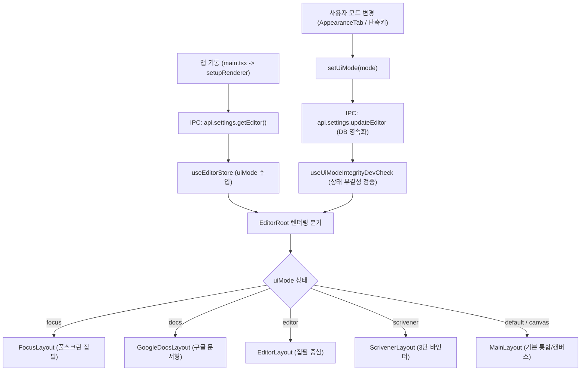

# Renderer 분석 및 로드맵 가이드

이 문서는 Luie 프로젝트의 Renderer 아키텍처 분석 결과와 향후 중점적으로 개선/수정해야 할 기술 과제 로드맵을 정리한 문서입니다.

---

## 1. Renderer 구조 및 아키텍처 분석

### 1.1. UI 모드 LifeCycle
Luie는 5가지 UI 모드(`default`, `docs`, `editor`, `scrivener`, `focus`)를 지원하며 다음 라이프사이클로 제어됩니다.

- **초기화**: [`setupRenderer()`](file:///Users/user/Luie/src/renderer/src/app/setup.ts)에서 DB 설정을 읽어 [`useEditorStore`](file:///Users/user/Luie/src/renderer/src/features/editor/stores/editorStore.ts)에 `uiMode` 주입.
- **레이아웃 스위칭**: [`EditorRoot.tsx`](file:///Users/user/Luie/src/renderer/src/features/workspace/components/layout/EditorRoot.tsx)에서 `uiMode`에 따라 전용 레이아웃 컴포넌트를 동적으로 분기 렌더링.
- **무결성 검증**: [`useUiModeIntegrityDevCheck`](file:///Users/user/Luie/src/renderer/src/app/shell/useUiModeIntegrityDevCheck.ts)가 모드 전환 시 비레이아웃 상태(원고 내용, 챕터 ID, 테마, 폰트 등)의 유실 여부를 스냅샷으로 감지.
- **패널 상태 영속화**: [`useProjectLayoutPersistence`](file:///Users/user/Luie/src/renderer/src/features/workspace/hooks/useProjectLayoutPersistence.ts)가 모드별 패널 크기 및 열림 상태를 분리 저장.

---

### 1.2. `react-virtuoso` 사용 현황
- **Settings 내부**: 가상화 라이브러리를 사용하지 않음. 설정 항목이 수십 개 수준으로 적기 때문에 표준 React `map` 및 `React.memo`([`ShortcutRow`](file:///Users/user/Luie/src/renderer/src/features/settings/components/tabs/ShortcutsTab.tsx))를 사용함.
- **실제 사용 위치**:
  - [`MemoSidebarList.tsx`](file:///Users/user/Luie/src/renderer/src/features/research/components/memo/MemoSidebarList.tsx): 대량 리서치 메모 목록 가상 스크롤.
  - [`SnapshotList.tsx`](file:///Users/user/Luie/src/renderer/src/features/snapshot/components/SnapshotList.tsx): 원고 버전 히스토리(스냅샷) 목록 가상 스크롤.

---

### 1.3. UI/UX 디자인 철학 및 시스템 구성
- **철학**: "흐름을 방해하지 않는 집필 도구 (Distraction-Free Professional Writing)"
  - 장식적 요소와 시각적 노이즈 배제, 작가의 집필 몰입(Flow) 최우선.
- **디자인 토큰 ([`global.tokens.css`](file:///Users/user/Luie/src/renderer/src/styles/global.tokens.css))**:
  - **Zinc Scale 뉴트럴 팔레트**: `--bg-app` (#ffffff), `--bg-sidebar` (#f4f4f5), `--text-primary` (#18181b), `--text-secondary` (#71717a), `--accent-bg` (#806330, 뮤트 브라스).
  - **4차원 테마 매트릭스**: Theme (`light`/`dark`), Contrast (`normal`/`high-contrast`), Temperature (`neutral`/`warm`/`cool`), Accent (`brass`/`blue`/`emerald`/`crimson`).
  - **Z-Index 표준화**: `--z-index-dropdown` (50), `--z-index-banner` (100), `--z-index-toast` (150), `--z-index-modal` (1000).

---

### 1.4. 불필요/정리 대상 스크립트 점검

| 대상 | 위치 | 내용 및 권장 조치 |
|---|---|---|
| `typecheck-ts7` / `typecheck:ts7` | `package.json` | TS 7.0 RC 실험용 스크립트. 현재 메인 검사는 `tsc6`를 사용하므로 실험 완료 후 제거 검토 |
| `supabase:openai:*` vs `supabase:llm:*` | `package.json` | 동일한 `scripts/supabase-openai.mjs`를 중복 호출하므로 `supabase:llm:*`으로 통일 |
| `generate` | `package.json` | `generate:icons` 단일 명령만 실행하므로 명칭을 명확히 하거나 통합 작업으로 묶음 |
| 다수의 `memory:*` 스크립트 | `package.json` | 20여 개의 로컬 캘리브레이션/벤치마크 스크립트 정리 및 서브커맨드화 검토 |

---

### 1.5. Renderer 전반의 아키텍처 및 라이프사이클
1. **진입 및 셸**: `main.tsx` (`initI18n` + `setupRenderer`) -> `App.tsx` (Bootstrap 상태 확인, `windowMode` 해시 라우팅, `onQuitPhase` 종료 수신) -> `ProjectTemplateSelector` / `EditorRoot`.
2. **상태 관리**: Zustand 슬라이스 스토어 (`uiStore`, `editorStore`, `projectStore`, `chapterStore`, `memoStore`, `snapshotStore`).
3. **통신 격리**: Node/Electron 직접 접근을 금지하고 `@shared/api`(`window.api`) Preload 브리지 엄격 준수.

---

## 2. Renderer 중점 개선 및 개발 로드맵 (TODO)

### 📌 P0: 집필 성능 및 데이터 안정성 (Core Writing Experience)
- [ ] **에디터 연산 비동기 워커 분리**:
  - 원고 타이핑 시 메인 UI 스레드에서 실행되는 글자 수/단어 수 통계 계산(`useEditorStats`), 스마트 링크 파싱, 텍스트 분석 로직을 Web Worker로 격리하여 입력 지연(Typing Latency) 최소화.
- [ ] **Tiptap 변경 시 리렌더링 범위 축소**:
  - 에디터 내용 변경 시 상위 셸이나 인접 패널(사이드바, 아웃라이너 등)이 불필요하게 리렌더링되지 않도록 Zustand `useShallow` 및 미세 구독(Transient updates) 최적화.
- [ ] **원고 유실 방지 로컬 버퍼(Fail-Safe) 강화**:
  - Main Process IPC 저장 외에도 렌더러 로컬(IndexedDB/LocalStorage)에 즉각적인 스냅샷을 남기는 이중 안전 버퍼 구축 및 크래시 복구 플로우 점검.

---

### 📌 P1: 렌더러 아키텍처 및 유지보수성 (Code Quality)
- [ ] **`EditorRoot.tsx` 전략 패턴 분해**:
  - 500줄 규모의 `EditorRoot.tsx`에서 5개 UI 모드 레이아웃 컴포넌트(`FocusLayout`, `GoogleDocsLayout`, `EditorLayout`, `ScrivenerLayout`, `MainLayout`)를 독립 컨테이너로 격리하여 모드별 책임 분리.
- [ ] **`domains/` vs `features/` 디렉토리 구조 일원화**:
  - `domains/`의 단순 Re-export(배럴 파일) 구조를 정리하고, 일관된 피처 중심(Feature-driven) 또는 도메인 중심 모듈 체계로 통합.
- [ ] **스크립트 정리**:
  - `package.json` 내 중복 스크립트(`supabase:openai:*` vs `supabase:llm:*`), 실험용 `typecheck-ts7` 정리.

---

### 📌 P2: 그래픽 & 디자인 시스템 완성도 (Visual & Memory)
- [ ] **World Graph (ReactFlow / Canvas) 뷰포트 가상화**:
  - 수백 개 이상의 엔티티/노드가 배치된 세계관 그래프에서 화면 밖 노드 뷰포트 컬링(Viewport Culling)을 적용하여 메모리 절약 및 드래그 렉 제거.
- [ ] **Tailwind v4 디자인 토큰 전수 검사**:
  - 컴포넌트 내 인라인 스타일이나 하드코딩된 픽셀/색상 값을 `global.tokens.css` `@theme` 토큰으로 표준화.
- [ ] **테마 전환 애니메이션 및 FOUC 방지**:
  - 다크 ↔ 라이트 ↔ 웜톤(종이 질감) 전환 시 화면 깜빡임 최소화.
